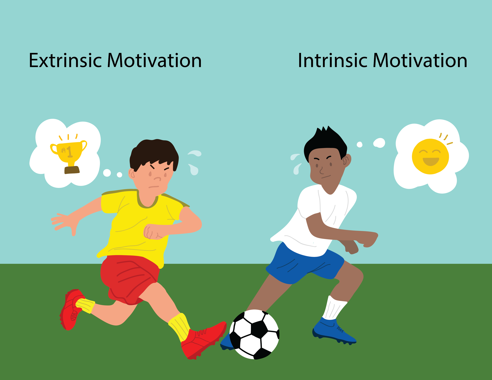

# Case study 2 {#sec-casestudy2}

## Case study on motivation: Does it arise from outside or inside an individual? {#sec-csmoti}

```{r}
#| echo: false
#| out.width: "90%"
#| fig.cap: "Source: Wikipedia"
#| fig.alt: "Photograph of intrinsically and extrinsically motivated players."

```

Reward systems are utilized in schools and the workplace, but are rewards operating in the opposite way from what is intended? Do external incentives promote creativity? To address this, researchers investigated whether people would tend to display more creativity when they are thinking about intrinsic or extrinsic motivations [@amabile1985 and @sleuth]. In this study, undergraduate students of similar creative writing experience were randomly assigned to one of two groups . One group received intrinsic questionnaires, and the other received extrinsic questionnaires. 

The intent of this treatment (the questionnaires) was to have students establish a thought pattern concerning a type of motivation (intrinsic -- doing something because it is rewarding or enjoyable; extrinsic -- doing something because we want to earn a reward or avoid punishment).  Researchers speculated that those who were thinking about intrinsic motivations would display more creativity than subjects who were thinking about extrinsic motivations. All subjects were instructed to write a Haiku, and those poems were evaluated for creativity by a panel of judges

The resulting experimental data is shown below, displaying the creativity score (`Score`) and the type of questionnaires (`Treatment`) assigned for a given undergraduate. Do the data provide evidence that creativity scores are affected by type of motivation?
```{r, moticasestudy }
#| echo: false
#| message: false
#| warning: false
#| results: 'asis'
#| fig.width: 7
#| fig.height: 3
#| fig.align: 'center'

require(dplyr)
require(readr)
library(kableExtra)
library(DT)

motidf<- read_csv("datasets/extintdata.csv" )
motidf <-motidf %>% mutate_if(is.character, factor)

datatable( motidf , class="hover", style="bootstrap4", rownames=FALSE,   height=250,  fillContainer = T, caption="Data from Amabile, T. (1985)br" ,
           options = list(scrollY = '350px', columnDefs = 
                           list(list(className = 'dt-center', 
                                     targets = "_all"))) )  
#kable(tmp , format = "markdown", digits = 2)  
#tmp2 %>%
 # kable( format = "html" )  %>%
  # kable_styling(  bootstrap_options = "condensed",  full_width = F, , font_size = 10)
```

### Summary of findings  {-}

Numerical and graphical summaries of the creativity scores for each motivation type are provided below.  

```{r}
#| label: fig-motiplots
#| fig-cap: "Boxplot (a) and histogram (b) of creativity by motivation type" 
#| fig-subcap:
#|   - " "
#|   - " " 
#| layout-ncol: 1
#| echo: false
#| message: false
#| warning: false

library(gridExtra)
library(lattice)
bp1 <- bwplot(  Score ~ Treatment,  data=motidf, xlab="Groups", ylab="Scores")


hist1 <-   histogram( ~Score | Treatment, xlab="Scores",
     #type = "density",
     ylim = c(0,45),
     groups = Treatment,   data=motidf)
     
 
 grid.arrange(bp1,hist1, ncol=2)

```


```{r }
#| label: tbl-motisums
#| tbl-cap: "The median, IQR, mean, and standard deviation of creativity scores for each group"
#| echo: false
#| eval: true
#| message: false
#| warning: false
#| results: 'asis'
 
 
motidf %>%
  group_by(Treatment) %>%
  summarise(
    Mean =   round(mean( Score),2), 
    SD =     round(sd(  Score ),2)
    ) %>%
  kbl(linesep = "", booktabs = TRUE, align = "lcccc") %>%
  kable_styling(bootstrap_options = c("striped", "condensed"), 
                latex_options = c("striped", "hold_position"))  
 # add_header_above(c(" " = 1, "Robust" = 2, "Not robust" = 2))

# t.test( Score ~ Treatment, data=motidf)
```

The creativity scores tended to be lower for the students in the extrinsic group (-4.14 difference in sample means), with both groups showing similar variability in scores. Are the scores between the two groups different enough to convince you that those thinking about intrinsic motivations display more creativity than subjects that were thinking about extrinsic motivations?  If not, how much larger should the mean be? Answers to such questions require inferential methods that will be discussed in a future chapter.    

Under the independent-observation model used for illustration, Welch's two-sided t-test gives p $\approx .00562$. A 95% confidence interval for the intrinsic minus extrinsic mean creativity score is (1.278, 7.011); equivalently, the interval for extrinsic minus intrinsic is (-7.011, -1.278). The estimated mean score is higher in the intrinsic group. A separate randomization test based on the treatment assignment is discussed in @sec-sifwork.

### Scope of inference {-}

Random assignment of questionnaire type supports a causal interpretation of the treatment comparison for these students, subject to the experiment's assumptions. Generalizing to a wider population of students requires additional support because they were not randomly sampled from that population.


