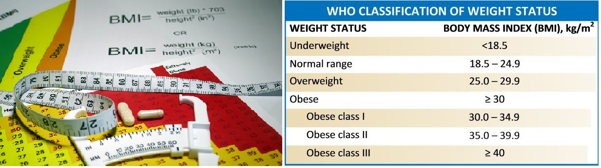

# Case study 4 {#sec-casestudy4}

## Case study on patterns of obesity across rural and urban regions {#sec-csob}


```{r}
#| echo: false
#| out.width: "90%"
#| fig.cap: "Source: https://hopkinsdiabetesinfo.org/glossary/body-mass-index/"
#| fig.alt: "Photograph a BMI and BMI scale."

```

Motivated by @ncd2019rising, the case study by @Wright2020 explored global patterns of mean body mass index (BMI) across rural and urban regions and countries. BMI is a measure of weight relative to height, defined as weight in kilograms divided by height in meters **squared**: $\mathrm{BMI}=\mathrm{weight\ (kg)}/[\mathrm{height\ (m)}]^2$. It is a screening measure, not a complete measure of an individual's health. The data described by @ncd2019rising contain the following variables:

- Country: Countries in the sample

- Sex: Men or women. The data recorded only contained data for groups of individuals described as men or women.

- Region: Type of region (rural or urban)

- Year:  1985 or 2017

- BMI: Averaged BMI values for the given year, sex, region, and country.

We use the data to explore whether mean BMI differs between urban and rural regions. The data are shown in the table below.

```{r, BMIcasestudydata }
#| echo: false
#| message: false
#| warning: false
#| results: 'asis'
#| fig.width: 7
#| fig.height: 3
#| fig.align: 'center'

require(dplyr)
library(kableExtra)
library(DT)
bmidf <- read.csv("datasets/BMIcsdata.csv")
bmidf <- bmidf %>% mutate( Country  = as.factor(Country ), Sex= as.factor(Sex),  Region = as.factor(Region)  )

datatable( bmidf , class="hover", style="bootstrap4", rownames=FALSE,   height=250,  fillContainer = T, caption="BMI case study data" ,
           options = list(scrollY = '350px', columnDefs = 
                           list(list(className = 'dt-center', 
                                     targets = "_all"))) )  
```  


### Summary of findings {-}

Numerical and graphical summaries of the BMI under different regions are provided below: 

```{r }
#| label: fig-bmiplots
#| fig-cap: "Survival of  all early-stage Delta Smelt larvae (0–40 dph) in the study reared under different light intensities. " 
#| fig-subcap:
#|   - " "
#|   - " " 
#| layout-ncol: 1
#| echo: false
#| message: false
#| warning: false
library(lattice)
 
bwplot( BMI ~ Region, data=bmidf, ylab=list(label="mean BMI", cex=1.2),
          scales=list(tck=c(1,0), x=list(cex=1.2), y=list(cex=1.2)))
 
```

```{r }
#| label: tbl-bmisums
#| tbl-cap: "A comparison of the mean and standard deviation of mean BMI for each region"
#| echo: false
#| eval: true
#| message: false
#| warning: false
#| results: 'asis'
 
 
# bmidf %>%
#   group_by(Sex) %>%
#   summarise(
#     Mean =   round(mean(BMI),3), 
#     SD =     round(sd(BMI),3)
#     ) %>%
#   kbl(linesep = "", booktabs = TRUE, align = "lcccc") %>%
#   kable_styling(bootstrap_options = c("striped", "condensed"), 
#                 latex_options = c("striped", "hold_position"))  
#  # add_header_above(c(" " = 1, "Robust" = 2, "Not robust" = 2))

bmidf %>%
  group_by(Region) %>%
  summarise(
    Mean =   round(mean(BMI),3), 
    SD =     round(sd(BMI),3)
    ) %>%
  kbl(linesep = "", booktabs = TRUE, align = "lcccc") %>%
  kable_styling(bootstrap_options = c("striped", "condensed"), 
                latex_options = c("striped", "hold_position"))  
 # add_header_above(c(" " = 1, "Robust" = 2, "Not robust" = 2))

```
  
The summaries suggest higher mean BMI in urban regions in these records. Each value is an average for a country, sex, region, and year, rather than the BMI of one person. Urban and rural averages from the same country are related comparisons. An analysis should account for this before testing for a difference.

### Scope of inference {-}
  

This observational case study describes relationships among mean BMI, region, and sex in the countries and years represented. It does not show that living in an urban or rural region caused the BMI differences.


