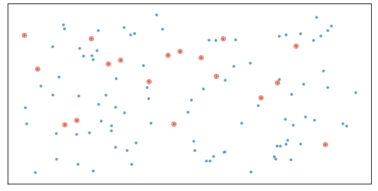
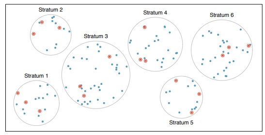
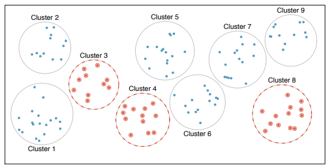
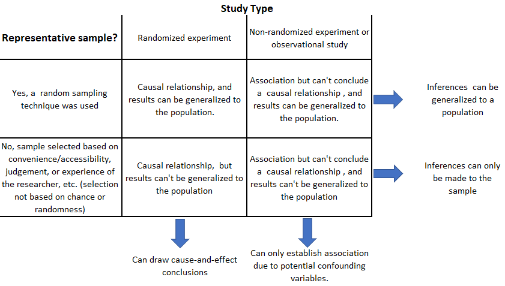

 
# Drawing statistical conclusions {#sec-drawconc}

{width=50%} 


##  Populations, samples, and collecting data

The first step in conducting research is to identify topics or questions that are to be investigated.  However, it is important to consider how data are collected so that they are reliable and help achieve the research goals. Important concepts related to data collection:

+ **Population**: The entire collection of objects or individuals that you want to study.

+ **Individual**, **case**, or **subject** :  A person or an object that is a member of the population being studied

+ **Sample**: A part of the population that is selected for the study.

Random sampling gives each member of the population a known chance of being selected. This helps us use the sample to learn about the population. However, a random sample can still differ from the population by chance. With a nonrandom sample, we need to consider how the sample was obtained before deciding who the results apply to.


Common sampling techniques include:

- Simple random sampling (SRS) -- Every possible sample of a given size has the same chance of being selected.

{#fig-srs}


- Stratified sampling -- Population is divided into groups called strata.  The strata are homogeneous and an SRS is taken from each stratum.

{#fig-strat}


- Cluster sampling -- Population is divided into groups called clusters that are not necessarily homogeneous.  A random sample of clusters is selected and all observations from each sampled cluster are used.  

{#fig-clust}

::: {.callout-important icon=true}
## A note about the size of the sample

**Common misconception**: A sample that is a small fraction of the population cannot accurately describe it. A carefully selected sample can provide useful information even when the population is very large. What matters is how the sample was selected, its size, and how much the values vary.

The methods used to draw conclusions should account for how the data were collected. More independent observations generally give more precise estimates. Measuring the same cases many times does not provide as much new information as measuring more independent cases.
:::


## Relationships among variables  
 
When two variables show some relationship or connection with one another, they are called **associated variables**. If it is believed that a variable might affect or be associated with changes in another variable, then in such cases, the first variable is designated  the **explanatory variable** and the second the **response variable**.

For example, can the height of a tree provide a reasonable estimate of its volume? Do certain types of diets significantly affect the early growth of chicks? Such questions can be explored using numerical and graphical summaries of data. However, whether the trends or patterns seen in these graphs can be attributed mostly to sampling, natural variability, or random error is uncertain.

::: callout-note

Recall the case study given in @sec-casestudy1  This data set has three variables (two categorical and one numerical variable):  level of exposure of light intensity (`Light`), turbidity level exposure (`Turbidity`), and the percentage of larvae that survived (`Survival`).  The questions posed were: Do levels of  light intensity (measured in $\mu mol/m^2/s$)  affect survival rates of early-stage Delta smelt larvae? What about levels of turbidity (measures in nephelometric turbidity units (NTUs))? Since we would like to know whether these factor variables might affect  the percentage of larvae that survived, `Light` and `Turbidity` are explanatory variables and `Survival` is the response variable.

:::
  
Two common ways to visualize the relationship between variables are scatter plots and box plots. In R, we create these plots using the `xyplot()` and `bwplot()` functions, respectively. Below are examples of these plots being used to explore the relationships between variables in two different datasets. Both of these functions are also discussed in @sec-numsum.


::: {.callout-tip icon=false}

## R functions
```
### xyplot( y ~ x , data , xlab, ylab, main, xlim, ylim, col, pch )
# y: Replace y with the name of the response numerical variable.
# x: Replace x with the name of the explanatory numerical variable.
# data: Set equal to data frame name
# xlab: set equal to the label for x-axis (optional).
# ylab: set equal to the label for y-axis (optional).
# xlim: set equal to the  range of the x-axis (e.g., c(0, 1)  provides
#       a lower bound 0 and upper bound of 1) (optional).
# ylim: set equal to the  range of the y-axis (optional).
# main: set equal to the title of the plot (optional).
# col:  Set equal to desired color for points (optional).  
# pch:  Set equalt o a number between 1-25 to change the point symbol (optional).  
#
#
### bwplot( y ~ x , data , xlab, ylab, main, xlim, ylim, box.ratio, 
             varwidth, horizonal, panel  )
# x: Replace x with the name of the explanatory categorical variable.
# horizontal: Set equal to TRUE if boxplots are to be drawn 
#            horizontally.  If set equal to true, change y~x
#            to x ~ y (optional).
# box.ratio: Set equal to a number between 0 and 1 to control the 
#            width of the rectangles. (optional)
# fill: Set equal to color to fill the box. Be default the box
#       is clear (optional).
# panel: Set equal to panel.violin to create violin plot (optional).
# pch: Set equal to "|" to denote median by a line rather than dot (optional).
#
```
::: 


```{r}
#| label: fig-treevol
#| warning: false
#| fig-cap: Tree volume vs. Tree height
#| fig.asp: .5
#| echo: true
#| eval: true
#| message: false
#| warnings: false
 
# Load the `lattice` package to create plots
library(lattice) 

# The built-in `trees` dataset is used to
# create a scatter plot of tree volume 
# versus tree height using the `xyplot` function.
xyplot( Volume  ~  Height , 
        data= trees , 
        ylab= "Tree Volume (cubic ft)" , 
        xlab= "Height (ft)" )
``` 
 

```{r}
#| label: fig-chicks
#| #| warning: false
#| fig-cap: Chick weight vs. Diet type
#| fig.asp: .5
#| echo: true
#| eval: true
#| message: false
#| warnings: false
 

# Data set `ChickWeight' contains variables weight and Diet
# It is a built-in data set.  bwplot() creates a boxplot 
# for a categorical variable (Diet) and a numerical 
# variable (weight).
bwplot( weight ~ Diet , 
        data= ChickWeight , 
        ylab= "Chick weight (gm)" , 
        xlab= "Diet type" )

```  
 
The graphical summaries above suggest that chicks on diets 3 and 4 tend to have higher weights than those on diets 1 or 2 in this sample. However, inferential methods would be necessary to determine whether these differences between diets are due to natural or sampling variability. The same goes for the trend seen in the scatter plot.


## Basics of experimental design

The following concepts of experimental design enable researchers to conclude that differences in the observed response data are likely due to the treatments and not  reasonably attributable to only chance:

- Randomization: Researchers randomly assign experimental units to treatments or conditions. This helps make the groups comparable, although some differences may still occur by chance.
 
- Replication: Apply treatments to multiple independent experimental units. This helps us distinguish treatment differences from ordinary variation. Repeated measurements of the same unit do not count as independent replications.

- Control: Keep other conditions comparable across treatment groups and use an appropriate comparison group.


- Blocking: A technique to include another factor variable that is not of primary interest in the experiment because it is believed it contributes to variation in the response. The experimental units may be grouped or blocked based on this factor variable. Randomization is then applied within each block to the treatment conditions. Blocks should be homogeneous.  


For those interested in learning more about the design and analysis of experiments, *Math 4220* is an applied course that explores various strategies for constructing and executing experiments that can be applied across the social, physical, and life sciences.  This course enhances the ability of one to  design experiments, carry them out, and analyze the resulting data.  
 

 


## Scope of inference  


The scope of inference of a study (from a statistician's perspective) addresses two questions: 

+ Do these results provide evidence for a causal relationship? (cause-and-effect or causation)

+ Can the results of the study be generalized to a population? (generalizability)

Random assignment helps us determine whether a treatment caused a difference. Random sampling helps us decide whether the results apply to a larger population. These are different goals. For observational studies, finding an association does not by itself establish cause and effect.


{#fig-scope}


::: callout-note

Recall @sec-csdelta. The light and turbidity conditions were applied to groups of larvae. In the data used here, medium light occurs only with medium turbidity. Therefore, a difference among the light groups could also be related to turbidity. These data alone do not tell us whether light caused the difference.

Conclusions should apply to the groups and conditions represented in the study. Whether the findings apply to other fish or other conditions depends on how the study was designed and how the groups were selected.

:::


