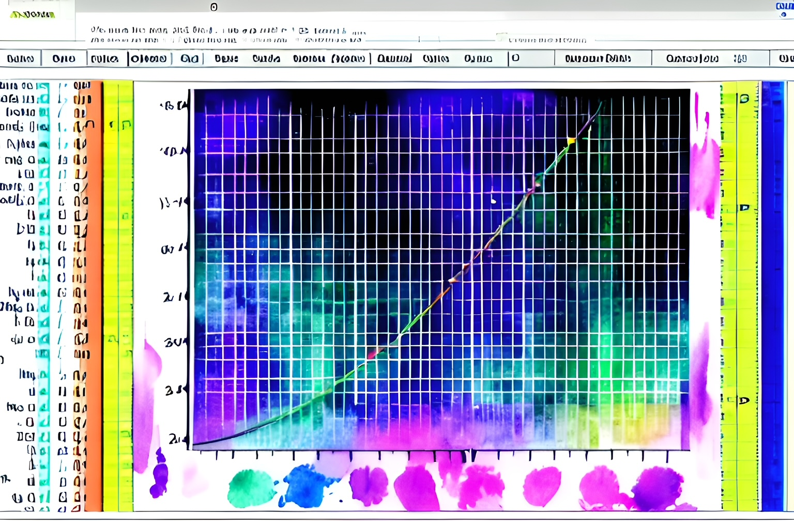

# Simple linear regression {#sec-regression}

{width=50%}

@sec-multinumvar addresses how to investigate the relationship between two numerical variables by looking at a scatterplot. Simple linear regression (SLR) is a statistical method used to model the linear relationship between two numerical variables, where one variable is the response variable and the other is the explanatory variable. SLR is a special case of linear regression, which models the relationship between two or more variables by fitting a linear equation to the observed data. This section focuses on SLR, which involves only one explanatory variable.

```{r }
#| label: fig-lrex
#| fig-cap: "Example of a linear relationship with the estimated or best fit SLR line with the predicted values shown as black points on the line" 
#| layout-ncol: 1
#| echo: false
#| message: false
#| warning: false
library(lattice)
 set.seed(4)
xtmp <- runif(30)
 ytmp <- 10 + 4*xtmp + .5*rnorm(30)
xyplot( ytmp ~ xtmp , xlab="Explanatory variable", ylab="Response variable", type=c("p", "r"),
    panel = function(x, y, ...) {
          panel.xyplot(x, y, ...)
          panel.xyplot(x = xtmp, y = fitted(lm(ytmp ~ xtmp)), col = "black", pch = 19)
         }
    )

```

:::{.callout-important}
## Notation

We start with some required notation and definitions: Let $y$ denote the response variable and $x$ denote the explanatory variable. The SLR model is of the form:

$$y = \beta_0 + \beta_1 x + \varepsilon$$

where:

- $\beta_0$ is the true intercept, the conditional mean of $y$ when $x=0$. Individual responses can differ from this mean.

-  $\beta_1$ is the true slope, which represents the average change in $y$ for a unit increase in $x$.

-  $\varepsilon$ is the random error term, which represents the random variability about the line in the relationship between $x$ and $y$ that is not accounted for by the linear regression model.

:::

The SLR model assumes that the value of $y$ is linearly related to $x$ via the line $\beta_0 + \beta_1 x$. However, the observed $y$ values deviate randomly from this line, as quantified by an error term. On average, the value of $y$ for a given value of $x$ is $\beta_0 + \beta_1 x$. The random error term signifies that other factors, such as measurement errors, unmeasured variables, or inherent variability in the data, may influence the response variable and are not captured or explained by the estimated SLR line

Note that the line shown in the above scatterplot is the estimated SLR line denoted by $\hat{y} = b_0 + b_1 x$.

:::{.callout-important}
## Notation

Note the following notation regarding the estimated SLR line:

- $\hat{y}$ is the predicted/fitted value of $y$ for a given value of $x$. 
  + A value of $\hat{y}$ represent the estimated expected/average/mean value of the response ($y$) at a given value of $x$.

- $b_0$ is the estimated intercept

- $b_1$ is the estimated slope.  
  + The slope estimate represents the change in $\hat{y}$ corresponding to a 1-unit increase in $x$[^1].

:::

Due to the random error in the relationship between the explanatory and response variables, the estimated line may not pass through every data point. The estimates of $b_0$ and $b_1$ are obtained using the method of least squares, which minimizes the sum of squared differences between the observed values of $y$ and predicted values $\hat{y}$. 

:::{.callout-important}
## Notation

- $e$ is the difference between the observed value of the dependent variable ($y$) and the predicted value ($\hat{y}$) and it is called a residual. 
  + The residuals represent the unexplained variation in the dependent variable that is not accounted for by the estimated SLR line.


:::


[^1]: The estimated intercept is the predicted mean response when $x=0$. Its practical interpretation depends on whether zero is meaningful and lies within the range relevant to the study.

Now that some basic of SLR have been covered, this section illustrates common key aspects of SLR, including:

-  Fitting the SLR model to data using R, model diagnostics, and interpreting the fit.

-  Performing a t-based test or a randomization test to determine the significance of the linear relationship between the two variables.

-  Constructing a t-based confidence interval for the slope of the regression line.

-  Applying basic remediation approaches.

For inferential methods to provide meaningful results,   several assumptions are made about the data on which the method is intended to be used. 

:::{.callout-warning}
## Data assumptions

 The methods discussed here assume one or more of the following assumptions about the data:

- **Assumption 1**. *Independence of errors*. Errors for different observational units are independent, conditional on the explanatory variable. Repeated measurements or shared conditions can violate this assumption.

-  **Assumption 2**. *No influential outliers*. The data should not contain any influential outliers[^2] that significantly affect the estimate SLR line.

- **Assumption 3**. *Normality for exact small-sample inference*. Errors are normally distributed at each predictor value. A QQ-plot of residuals is a diagnostic proxy. Large-sample approximations require suitable regularity conditions and do not resolve dependence or nonconstant variance.

- **Assumption 4**. *Constant error variance*. The spread of responses about their conditional mean is approximately constant across predictor values.

-  **Assumption 5**. The variables are *linearly related*, meaning that a straight line can accurately represent the trend in the scatterplot.

While these assumptions are assessed below with a case study, assumption 1 can be assessed using residual plots along with the study design. Assumption 2 can be examined using a histogram or boxplot of the data or residuals, assumption 3 with normal QQ-plot of the residuals, assumption 4 with a scatterplot of the residuals against the predicted values, and assumption 5 with a scatterplot of the data.

:::

[^2]: An influential observation substantially changes the fitted coefficients when it is omitted. Such an observation is not necessarily an error or evidence of a bad model; examine its validity and its impact on the conclusions.

 

## Fitting the SLR model and model diagnostics.

The function `lm()` is used to fit the SLR model to the data.

::: {.callout-tip icon="false"}
## R functions

```
### lm( y ~ x , data )
# y: replace y with the name of the response (measured)
#  variable of interest
# x: replace x with the name of the explantory variable
# data: set equal to a data frame that is in tidy form
#
```

:::

Note that the R functions used in these modules often have identical arguments, which will no longer be described in this module. The `lm()` function provides more than just the values of $b_0$ and $b_1$, and the illustrations below show how to use it to create an *lm object* that contains useful information. To summarize the SLR model fit, extract fitted values, or extract residuals from the *lm object*, we use the `summary()`, `predict()`, and `residuals()` functions on the *lm object*, respectively. The function `xyplot()` can be used to plot the data along with the estimated SLR line by specifying an argument called `type`:

::: {.callout-tip icon="false"}
## R functions

```
### summary( lm object )
# lm object: An object saving the result of usuing 
#      the lm function.
#
### predict( lm object )
#
### residuals( lm object )
#
### xyplot( y ~ x, data, type=c("p", "r") )
#
```

:::

The `summary()` function will provide a lot of information, including the values of $b_0$ and $b_1$.

Model diagnostics assess whether the model's assumptions are reasonable. The `tactile` package extends `xyplot()` to display diagnostic plots for an *lm object*. The plots below address different aspects of fit:

- **Residuals vs. predicted values**: Look for curvature in the conditional mean, changing spread, and unusual residuals. Absence of a visible pattern does not establish independence. Dependence should also be assessed using the study design and residuals plotted in time or observation order, where applicable.

- **Normal QQ-plot of the residuals**: The plot helps to assess assumption 3. If the residuals are normally distributed, the points on the plot will roughly follow a straight line. 

- **Scale-location plot**: This plots the square root of the absolute standardized residual against the predicted value. It helps assess whether residual spread changes across fitted values. The plotted square roots are nonnegative and do not have mean zero.

- **Residuals vs. leverage plot**: Leverage measures how unusual a predictor value is relative to the other predictor values. Large residuals combined with high leverage can identify influential observations. Cook's distance summarizes the effect on the fitted coefficients; this plot does not establish independence or constant variance.

::: callout-note
We fit the SLR model to the data described in the case study provided in @sec-casestudy3 to model the linear relationship between Pm10 and temperature. The data provided in the case study consists of several variables (`PM10`, `AQI`, ..., `county`, and `City.Name`) with `PM10` and `temp` being the variables of interest.

To begin, we import the data, and then one would explore the data using numerical and graphical data summaries. Numerical and graphical data exploration for bivariate data are covered in other modules but we start by assessing the linearity of the relationship. 

::: {.panel-tabset}
## R code

```{r }
#| echo: true
#| eval: true
#| message: false
#| warning: false

# Import data 
PM10df <- read.csv("datasets/DailyPM10.2021.csv")

# obtain the names of the variables
names( PM10df )


library(lattice) # provides the xyplot() function
xyplot( PM10 ~ temp , 
    data= PM10df , 
    xlab= "Temperature" , 
    ylab= "Particulate matter 10 micrometers or less (PM10)" ,
    main= "PM10 vs Temperature" ,
    col="black" ) # default color is "blue")
```

## Video
```{r}
#| echo: false
#| eval: true

library("vembedr")

embed_youtube("d1LI4eSXKGU")

```

:::

The scatterplot reflect a positive linear trend with some outlying PM10 measurements. To address the presence of outliers when conducting inference, we will consider some approaches in the last section. For now, we will proceed with fitting the SLR model in R for the purpose of illustration. This will involve using the `lm()` to fit the model and `xyplot()` to show the estimated SLR line:

::: {.panel-tabset}
## R code

```{r }
#| echo: true
#| message: false
#| warning: false

# The function will require the following information:
# y: replace with 'PM10'
# x: replace with 'temp'
# data: set equal to a 'PM10df'
lm( PM10 ~ temp,
  data= PM10df )

# xyplot now includes a new argument called type. 
# Set type=c("p", "r"). This tells xyplot() to plot both the 
# points and the estimated line. A few additional
# aesthetic arguments are provided below as well. 
xyplot( PM10 ~ temp,
  data= PM10df,
  type=c("p", "r"), # ensures both data points and est. reg. line is plotted
  col.line = "red", # make the line red 
  lwd= 2 ) # make the line wider

```

## Video
```{r}
#| echo: false
#| eval: true

library("vembedr")

embed_youtube("oLqPQjRUKhg")

```

:::


The output provides $b_0=-12.77$ and $b_1=0.8053$. With $b_1=0.8053$, it is estimated that PM10 levels (the response), on average, changes by $.8053$ when temperature (the explanatory) is increased by 1 degree. The `lm()` function provides much more than just these values. To extract other information, the result from `lm()` must be stored. Below the resulting `lm()` fit is stored and then the `summary()` is applied to this object. The functions `residuals()` and `predict()` are also illustrated below. 


::: {.panel-tabset}
## R code

```{r }
#| echo: true
#| message: false
#| warning: false

# Store lm() fit in an object, call it PM10fit
PM10fit <- lm( PM10 ~ temp,
         data= PM10df )

# PM10fit is called an lm object
summary( PM10fit )

# extract the residuals from PMfit
# and store in an object called PM10res
PM10res <- residuals( PM10fit )

# extract the predicted values from PMfit
# and store in an object called PM10predict
PM10predict <- predict( PM10fit )


```

## Video
```{r}
#| echo: false
#| eval: true

library("vembedr")

embed_youtube("QnGjWGY5znE")

```

:::


Note that the `summary()` provides the following table:

|       | Estimate | Std. Error | t-value  | p-value     |
|-------------|----------|------------|-----------|-----------------|
| (Intercept) | $b_0$  | $SE_{b_0}$ | $T_{b_0}$ | p-value$_{b_0}$ |
| explanatory | $b_1$  | $SE_{b_1}$ | $T_{b_1}$ | p-value$_{b_1}$ |

The terms $SE_{b_0}$ and $SE_{b_1}$ are the standard errors for $b_0$ and $b_1$. The table also provides the coefficient of determination or $R^2$ (`Multiple R-squared: 0.1355`). The value of $R^2$ is the sample correlation, $r$, squared. In terms of its interpretation, $R^2$, measures how well the estimated SLR line fits the data. A higher value of $R^2$ indicates a better fit, meaning that more of the variance in the response variable can be explained by the explanatory variable. However, a high or low value of does not necessarily imply a significant linear relationship. Here, temperature explains $13.55$% of the total variation observed in PM10 measurements. In other words, the SLR model accounts for only a small fraction of the variability in PM10 measurements, and there may be other variables that are not included in the model that also affect PM10 levels. The rest of the information provided by `summary()` will be addressed as needed throughout the rest of these sections.

The next sections cover different inferential methods for a SLR, and they require for the assumptions of the data to be reasonable. Next, we perform model diagnostics to assess the model assumptions with the help of `xyplot()` after loading the `tactile` R package:

::: {.panel-tabset}
## R code

```{r }
#| label: fig-usingtactile
#| fig-cap: Diagnostic plots
#| layout-ncol: 1
#| echo: true
#| message: false
#| warning: false


# This package provides diagnostic 
# plots using xyplot()
library( tactile ) 

# To create a set of pre-specified 
# residual plots, provide the lm object
# to xyplot()
xyplot( PM10fit )

```

## Video

See previous video.

:::


The scatterplot showed a linear trend in the data, so assumption 5 (linearity) is reasonable. The residual plots provided by `xyplot()` (excluding the normal QQ-plot) will have a black (not necessarily linear) trend line that is lowess smoother[^3]. Each plot is analyzed and interpreted below:

- The upper and lower left plots display the residuals against the predicted value and the square roots of absolute standardized residuals against the predicted values, respectively. The plot shows the following characteristics:
  - Neither plot shows an obvious mean trend, but these plots alone do not establish independence of the daily measurements.
  - There are a few potential outliers and the variability of the residuals is not constant across the predicted values, so assumptions 2 and 4 are questionable. 

- The upper-right normal QQ-plot[^4] suggests departures from normality. A large sample may support an approximation under additional conditions, but it does not resolve temporal dependence or nonconstant error variance.

- The lower-right plot compares standardized residuals with leverage. Cook's distance[^5] contours, if shown, help identify observations that affect the coefficients. Leverage and Cook's distance measure different quantities. A visual threshold alone should not be used to declare the model valid.

 
[^3]: A lowess smoother is a method used to smooth out noisy data by fitting a curve to the data points based on a local neighborhood around each point, where closer points have a higher influence on the resulting curve. It helps to identify trends and patterns in the data that might not be immediately visible.

[^4]: QQ-plots are discussed in the  Basic Exploratory Data Analysis module.  

[^5]: Cook's distance is a measure of both the leverage and influence of a data point on the regression coefficients. This measure is often used to identify potentially influential observations (typically those with a Cook's distance exceeding 1). Note that Cook's distance is just one tool (of many others) for identifying influential observations.

Overall, not all data assumptions are met for the SLR model. In such cases, we say the model did not pass the model diagnostics. Possible remedial measures will be discussed in the last section. For now, we will proceed with this model for the purpose of illustrating inferential methods, as if it were appropriate for the data.

:::

## Testing the significance of the linear relationship using t-based methods.

The focus in this section is on inference for $\beta_1$ (the true slope), where $\beta_1$ represents the change in the average value of $y$ when $x$ is increased by 1-unit. The t-test for the slope of a regression line is a widely used hypothesis test to assess the significance of a linear relationship between two variables. Specifically, the test is used to determine if the true slope $\beta_1$ is significantly different from zero, based on the observed value of $b_1$. It is important to note that the observed value of $b_1$ can vary. If a study were replicated, the value of $b_1$ would likely be different. The use of inferential methods allows us to account for this variability and make statistically valid conclusions about the true slope $\beta_1$. A t-based confidence interval can be constructed for $\beta_1$ and it provides a range of plausible values for the true slope at a specified significance level. These methods are generally referred to as t-based methods for the slope.

The t-test for the slope of a regression line requires that certain assumptions (1, 2, 3, 4, and 5[^6]) about the data are reasonable. The test statistic for this t-test is given by:

$$T=\frac{b_1-\beta_1}{SE_{b_1}} $$
 
Here, $SE_{b_1}$ represents the standard error of $b_1$[^7]. Our primary interest is in determining if there is a significant linear relationship (association) between the explanatory variable and response variable, which translate to $\beta_1\neq 0$. Consequently, the null and alternative hypotheses are:

$$H_0: \beta_1=0 \qquad H_a: \beta_1 \neq 0$$

Note that when two variables are linearly related or associated, it means that they are correlated, and when two variables are correlated and linearly related, it implies that they have a linear relationship or association. Under $H_0$, the null distribution of the test statistic $T$ follows a t-distribution with $n-2$ degrees of freedom, where $n$ is the sample size. This distribution is used to compute the p-value. The function `lm()` computes the test statistic and p-value for the t-test for a linear association in a SLR, and the results are provided by the `summary()` output. Recall that the `summary()` function provides a table with relevant information, including the test statistic and p-value for the t-test, as well as other statistics like the coefficient estimates and standard errors:

|       | Estimate | Std. Error | t-value  | p-value     |
|-------------|----------|-------------|-----------|-----------------|
| (Intercept) | $b_0$  | $SE_{b_0}$ | $T_{b_0}$ | p-value$_{b_0}$ |
| explanatory | $b_1$  | $SE_{b_1}$ | $T_{b_1}$ | p-value$_{b_1}$ |

Here, $T_{b_1}$ and p-value$_{b_1}$ refer to the test statistic for the slope and two-sided p-value$_{b_1}$, respectively for testing if $\beta_1\neq 0$. The function `lm()` can also be utilized to obtain a confidence interval (CI) for the true slope $\beta_1$. To obtain a CI, apply the `confint()` function to the resulting *lm object*. 


::: {.callout-tip icon="false"}
## R functions

```
### confint( lm object , parm , level)
# lm object: An object saving the result of usuing 
#      the lm function.
# parm: Set equal to 2 
# level: Set to desired confidence level.
#
```
:::

 
[^6]: Readers may have heard of a correlation test, which is equivalent to a t-test for the slope in SLR, but a correlation test requires the normality assumption even for large samples. 

[^7]: The standard error of the slope estimate quantifies how much $b_1$ will vary across different samples if the study were replicated many times. A smaller standard error means that the estimate is more precise and varies less across different samples, while a larger standard error means the opposite. 


::: callout-note

We apply a t-test to the data described in the case study from @sec-casestudy3 to determine if there is a significant linear association between PM10 and temperature levels at $\alpha=.05$. Recall that not all the required assumptions are met, but we perform the test for the purpose of illustration. Let $\beta_1$ denote the true slope in the linear association between PM10 and temperature. Since the aim is to determine if there is a significant linear relationship or association, the hypothesis is

$$H_0: \beta_1=0 \qquad H_a: \beta_1 \neq 0$$


The following code uses `lm()` and `summary()` to compute the test statistic and the corresponding p-value for a t-test:

::: {.panel-tabset}
## R code

```{r }
#| echo: true
#| eval: true
#| message: false
#| warning: false

# PM10fit was created in the previous section
# but the code is given here as reminder. 
# Below, the result from lm() is 
# stored in an object, called PM10fit
PM10fit <- lm( PM10 ~ temp,
         data= PM10df )

# summarize the lm object, PM10fit. 
summary( PM10fit )
```

## Video
```{r}
#| echo: false
#| eval: true

library("vembedr")

embed_youtube("9CG0vvg016k")

```

:::

The nominal slope statistic is $T=20.655$ with a very small p-value under the independent, constant-variance error model. At $\alpha=.05$, that model-based test rejects a zero slope. The fitted association is positive, but the earlier diagnostics and repeated daily sampling raise concerns about the standard errors. Treat this as an illustration of the procedure, not as a validated causal or population-wide conclusion.
 
The function `confint()` is used to obtain a 95% CI for $\beta_1$:

::: {.panel-tabset}
## R code

```{r }
#| echo: true
#| eval: true
#| message: false
#| warning: false

 
# summarize the lm object, PM10fit. 
confint( PM10fit ,
     parm= 2 , # Setting parm =1 will provide CI for beta0
     level= .95 )
```

## Video

See previous video.

:::

Under the same model, the nominal 95% interval for $\beta_1$ is approximately (0.729, 0.882) $\mu g/m^3$ per $^\circ F$. It estimates the change in mean PM10 associated with a one-degree increase in temperature. Its coverage depends on the model assumptions, including the error variance and dependence structure.

The interval describes the fitted association at the represented monitoring sites. It does not establish a causal temperature effect or justify generalization beyond the measured sites and conditions.

:::


## Testing the significance of the linear relationship using a randomization test

A randomization or permutation test compares an observed slope statistic with values obtained by reallocating responses under a justified null model. Under a sharp no-treatment-effect null in a randomized experiment, the allocation must follow the actual treatment assignment. In an observational regression, unrestricted shuffling requires that responses be exchangeable with respect to predictor values under the null. A zero slope alone does not imply exchangeability: nonlinear dependence or changing variance can remain.

::: {.panel-tabset}
## R code

```{r }
#| label: fig-randlrex
#| fig-cap: "Example of a linear relationship with the estimated or best fit SLR line. The red circle denote the third observation in the data." 
#| layout-ncol: 1
#| echo: false
#| message: false
#| warning: false
library(lattice)
 set.seed(4)
xtmp <- runif(30)
 ytmp <- 10 + 4*xtmp + .5*rnorm(30)
xyplot( ytmp ~ xtmp , xlab="Explanatory variable", ylab="Response variable", type=c("p", "r"),
    panel = function(x, y, ...) {
          panel.xyplot(x, y, ...)
          panel.xyplot(x = xtmp[3], y = ytmp[3], col = "red", pch = "O", cex=2.5 )
         }
    , ylim=c(10, 15))

```

## Video
```{r}
#| echo: false
#| eval: true

library("vembedr")

embed_youtube("QnGjWGY5znE")

```

:::


When responses are exchangeable under the null, permuting their pairings with the predictor provides a reference distribution. This condition must be justified from the design and model; lack of a linear trend is not sufficient.

The aim is still to see if there is a significant linear relationship or association:

$$H_0: \beta_1=0 \qquad H_a: \beta_1 \neq 0$$

For illustration, the code below permutes the observed responses while holding predictor values fixed. This targets an exchangeable-response null. If observations are temporally correlated, clustered, or have predictor-dependent error variances, unrestricted permutations need not produce a valid test.

The figure illustrates one such permutation. A valid reference distribution is formed by repeating permutations allowed by the null model and recomputing the statistic.

```{r }
#| label: fig-randlrexshuff
#| fig-cap: "The resulting scatterplot after permuting the observed response values without replacement"
#| layout-ncol: 1
#| echo: false
#| message: false
#| warning: false
library(lattice)
 set.seed(4)
xtmp <- runif(30)
 ytmp <- 10 + 4*xtmp + .5*rnorm(30)
 set.seed(41)
 yrand <- sample(ytmp, replace=FALSE)
xyplot( yrand ~ xtmp , xlab="Explanatory variable", ylab="Response variable", type=c("p", "r"), ylim=c(10, 15) )

```

Permutation methods can be useful when a normal-error model is unsuitable, but they do not automatically repair nonconstant variance or dependence. Use a method justified for the specific design and null. Here the statistic is the usual slope t-statistic:

$$T=\frac{b_1-\beta_1}{SE_{b_1}} $$
To obtain the null distribution of $T$, the randomization process is repeated many times, each time computing the value of $T$. We then obtain the null distribution of $T$ by randomly shuffling (randomization) the observed values of the response variable many times, each time computing the value of the test statistic for the randomized data. The R function `slr.randtest()` computes the test statistic and p-value for the randomization test. 
 
::: {.callout-tip icon="false"}
## R functions

```
### slr.randtest( y ~ x, data, nshuffles, direction )
# nshuffles: Set equal to the desired number of randomizations. 
# x: replace x with the name of the explantory variable
# direction: the sign in the alternative, "two.sided", "greater" , or "less"
#
```

:::


::: callout-note

We demonstrate the calculation on the PM10 and temperature records at $\alpha=.05$. The unrestricted permutations shown here are a computational illustration: repeated measurements, shared weather, and possible nonconstant variance mean exchangeability has not been established. A substantive analysis should account for those features before interpreting a p-value.

$$H_0: \beta_1=0 \qquad H_a: \beta_1 \neq 0$$


The following code uses `slr.randtest` to compute the test statistic and the corresponding p-value for the randomization test:

::: {.panel-tabset}
## R code

```{r }
#| echo: true
#| eval: false
#| message: false
#| warning: false

# Source the function so that it's R's memory.
source("rfuns/slr.randtest.R")

# The function will require the following information:
# y: replace with 'PM10'
# x: replace with 'temp'
# data: set equal to a 'PM10df'
# nshuffles: Set to 30000 randomization 
# direction: Set to "two.sided"
slr.randtest( PM10 ~ temp ,
       data= PM10df , 
       nshuffles=30000 , 
       direction = "two.sided" )
# Randomization test for a linear association in SLR 
#
#> data: PM10 ~ temp 
#> Obs. test statistic= 20.65466    
#> Obs. slope estimate= 0.8053192    
#> R-squared = 0.135493 
#> p-value = 0 
#> 
 

```

## Video
```{r}
#| echo: false
#| eval: true

library("vembedr")

embed_youtube("p0LXHWTX7lI")

```

:::

```{r }
#| label: fig-slrnullrand
#| fig-cap: "A histogram of the null distribution of T resulting from 30,000 randomizations" 
#| layout-ncol: 1
#| eval: false
#| echo: false
#| message: false
#| warning: false

# Source the function so that it's R's memory.
load("misc/SLRrandhist.RData")

library(lattice)
print(randhist)

```

The observed statistic is approximately 20.655. The permutation output estimates the tail probability under the exchangeable-response null used by this calculation. A small value indicates incompatibility with that null, provided its assumptions hold; the previously noted dependence and variance concerns prevent treating this illustration as a validated inferential conclusion.

:::


## Remedial measures {#sec-remedmeasure}

If the model fails diagnostics, one possible remedial measure is to transform the response variable. This can be particularly helpful if only assumption 4 (equal variance or spread) is not met and/or if the small sampled data are skewed. A transformation is a rescaling of the data. Below are some standard transformations for the response variable that may help the data (on a transformed scale) better meet the assumptions[^8]:

| Transformation  | Formula      | Description                             |
|-------------------|--------------------|---------------------------------------------------------------------|
| Square root    | $y' = \sqrt{y}$  | Square root of the response                     |
| Natural log    | $y' = \ln(y)$   | Natural log    of the response                  |
| Square      | $y' = y^2$     | Square of the response                       |
| Inverse      | $y' = \frac{1}{y}$ | Inverse of the response                       |

[^8]: The explanatory variable may also be transformed to address issues with the model's assumptions or to better capture the relationship between variables. However, for brevity, we will only focus on transforming the response variable.

The function `mutate()` from the `dplyr` package will be used to add transform variables to a data frame.

::: {.callout-tip icon=false}

## R functions
```
### mutate( data frame ,'new variable' = 'function of variable in data frame', ...)
# data frame: Replace with the name of the data frame
# 'new variable': Replace with the name of the new variable
# 'function of variable in data frame': Replace with a function 
# of a variable pesent in the data frame.
# 
```
:::


::: callout-note
The residual plots suggest that spread varies across predicted values, making the constant-variance assumption questionable. We illustrate transforming PM10 using `mutate()`; a transformation should be followed by renewed model diagnostics and does not automatically remove dependence.

::: {.panel-tabset}
## R code

```{r }
#| eval: true
#| echo: true
#| message: false
#| warning: false

# Source the function so that it's R's memory.
library(dplyr) # provides mutate()

# Below we create a modified version of the PM10df,
# called PM10mod, that contains the transformed response
PM10dfmod <- mutate( PM10df,
           sqrty = sqrt( PM10 ) , # square root transformed
           invy = 1/PM10 ,    # inverse transformed
           ysq =  PM10^2 )    # squared transformed
# natural log and inverse considered due to 0's. 

# The data frame contains the transformed variables
names( PM10dfmod )

```

## Video
```{r}
#| echo: false
#| eval: true

library("vembedr")

embed_youtube("I0UOPc1ykc0")

```

:::

Now, plot the transformed variables against the explanatory:

::: {.panel-tabset}
## R code

```{r }
#| layout-ncol: 2
#| eval: true
#| echo: true
#| message: false
#| warning: false

xyplot( PM10 ~ temp, 
    data= PM10dfmod, 
    xlab= "Temperature", 
    ylab= "Original scale") 

xyplot( sqrty ~ temp , 
    data= PM10dfmod , 
    xlab= "Temperature" , 
    ylab= "Square root scale" )

xyplot( invy ~ temp , 
    data= PM10dfmod , 
    xlab= "Temperature" , 
    ylab= "Inverse scale" )


xyplot( ysq ~ temp , 
    data= PM10dfmod , 
    xlab= "Temperature" , 
    ylab= "Squared scale" )
 
```
## Video

See previous video.

:::

:::

The square root transformation appears to reduce the impact of outliers and make the linear trend more evident. Next, the SLR model would be fitted using `lm()` with the formula `sqrty ~ temp` and `data = PM10dfmod argument`. After fitting the model, the residuals would be assessed to determine if the transformed data are appropriate for the model.


## Sample size estimation and power analysis for SLR

Ideally, estimating the sample size for a study is one of the first things that researchers do prior to collecting data.  Knowing the sample size required to detect a desired effect at the beginning of a project allows one to manage their data collection efforts. Further, this allows for one to determine how much statistical power the test will have to detect an effect if it exists.

The R function `pwr.f2.test()` from the `pwr` R package provides statistical power calculations for a SLR model when the sample size, significance level ($\alpha$), and effect size are provided.  It is assumed the appropriate assumptions about the data for the t-test are met.

::: {.callout-tip icon=false}

## R functions
```
### pwr.f2.test( u, v, f2, sig.level , 
###           power)
# u: Set equal 2.
# v: Set equal to n-2, where n is the 
#   sample size.
# f2: Set equal to the desired effect size
# sig.level: Set equal to the desired alpha value (significance level)
# power: Set equal to the desired power (a number between 0 and 1). 
#
```

:::
<!-- The effect size, `f2`, is a function of $R^2$, $f2=\frac{R^2}{1-R^2}$. For example, if a SLR is sought that we explain 60% of the variation in the response, then -->
<!-- $$f2=.60/.40=1.5$$ -->

$f2$ is a called Cohen's $f2$ and is typically interpreted as follows:

- Small effect size: $f2 = 0.02$

- Medium effect size: $f2 = 0.15$ 

- Large effect size: $f2 = 0.35$ or higher.

These are suggested guidelines and may vary slightly depending on the specific field of research or context of the study. 

::: callout-note

Suppose we want to determine the statistical power to detect a medium-sized effect assuming a sample size of 30 observations at significance level of $\alpha=.001$. 
```{r }
#| echo: true
#| eval: true
#| message: false
#| warning: false


library(pwr) # provides power.f2.test

pwr.f2.test(u = 2 , 
      v = 28 , # 30 - 2 
      f2 = .02 , 
      sig.level = .001 ) 

```
 
The statistical power of this test is rather low, although not surprising given the sample size, $\alpha$ specified, and size of the effect. To increase the power, one may increase the effect size (the larger it is, the easier it is to detect), increase $\alpha$ (make it easier to reject $H_0$ and find a significant effect), and/or increase the number of observations per group.

If instead you sought to collect a sample that would provide a power of $.90$ for detecting a small effect at $\alpha=.001$, we use the `power` argument but not specifying $v$:
```{r }
#| echo: true
#| eval: true
#| message: false
#| warning: false

pwr.f2.test(u = 2 , 
      power = .90 ,  
      f2 = .02 , 
      sig.level = .001 ) 

```

Thus, to ensure a power of at least .90, a sample of size 1195 should be collected. 

:::
 
 

