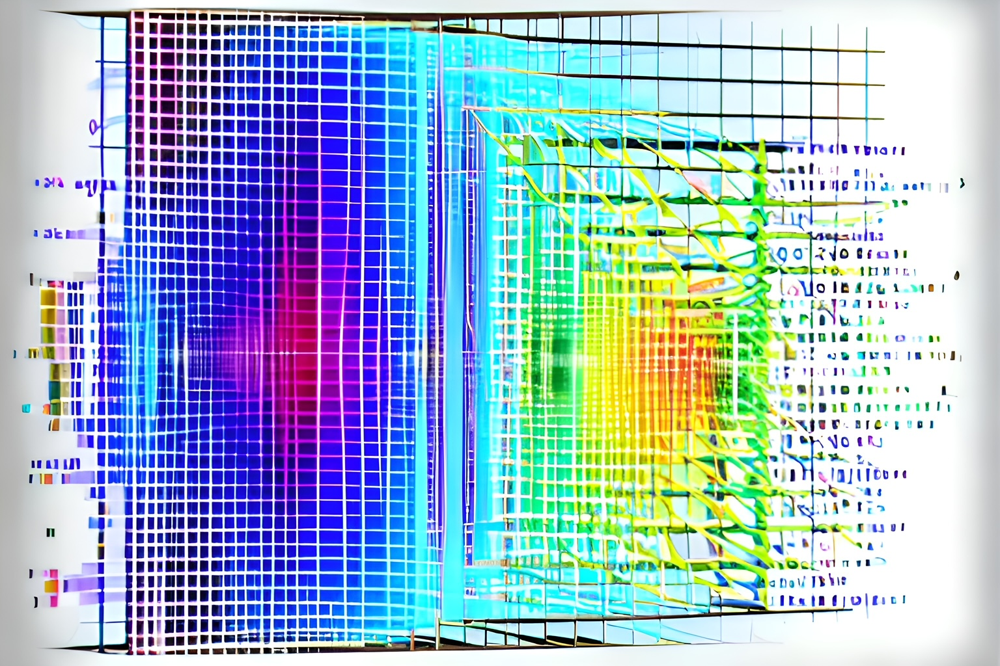

# PCA {#sec-pca}
 
{width=50%}

This section introduces an advanced exploratory data analysis method called Principal component analysis (PCA). PCA summarizes the information[^1] in data that is composed of multiple variables.  Below is a scatterplot and correlation matrix of a dataset that consists of five variables. The scatterplot shows the pairwise relationships between the variables and they are useful for visualizing relationships, clusters, and outliers. The correlation matrix provides a numerical measure of the strength and direction of these relationships. This section only covers PCA on standardized data.

[^1]: Here, information refers to the total amount of variation in the data. 

```{r }
#| label: fig-pcaex
#| fig-cap: "Example of a linear relationship with the estimated or best fit SLR line with the predicted values shown as black points on the line" 
#| layout-ncol: 1
#| echo: false
#| message: false
#| warning: false

library(lattice)
library(gpairs)
library(corrplot) 

# Simulate data to illustrate aspects of PCA

# Set the number of variables and observations
nvars <- 5
nobs <- 100

# Set seed for simulation
set.seed(13)

# Generate random data with mean 0 and standard deviation 1
simdata <- matrix(rnorm(nvars * nobs), nrow = nobs)

# Add some correlation between the variables
simdata[,2] <- .5*simdata[,1] + rnorm(nobs, mean = 0, sd = 0.85)
simdata[,3] <- 0.65 * simdata[,1] + 0.5 * simdata[,2] + rnorm(nobs, mean = 0, sd = 0.82)
simdata[,4] <- rnorm(nobs, mean = 0, sd = 0.8)
simdata[,5] <- 0.2 * simdata[,1] + 0.8 * simdata[,4] + rnorm(nobs, mean = 0, sd = 0.4)

simdata<-as.data.frame(simdata)
names(simdata) <- c("x1", "x2", "x3", "x4", "x5")

gpairs( simdata , 
        diag.pars=list(fontsize = 6))

M <- cor(simdata)
corrplot.mixed(M, order = 'FPC',  tl.pos="lt")


```

The summaries show positive and negative correlations of varying strengths. The introductory example has five variables, with 10 distinct three-variable combinations; the later xylem example has nine variables, with 84 such combinations. Exploring all combinations becomes cumbersome as dimensionality grows, motivating methods such as PCA.

PCA is a powerful and widely used technique for extracting dominant modes of variation from a dataset. The data must consist of only numerical variables. The goal of PCA is to identify directions (or principal components or modes of variation) along which the variation in the data are maximal. The dominant modes of variation in PCA correspond to the principal components that explain most of the variation in the dataset. Thus, a few principal components (PCs) may capture almost as much of the variation as the original variables.  Such principal components capture the most important patterns or structures in the data. In some cases, the dominant modes of variation may be associated with specific features or facets in the data, allowing for a better understanding of the underlying variation processes that generates the data. 

To better ensure that PCA provides meaningful results, several assumptions about the data  are recommended.

:::{.callout-warning}
## Data assumptions

The following considerations help assess whether PCA will provide an informative and stable summary:

- **Consideration 1**. *Sampling and dependence*. PCA does not require the variables to be independent; it often summarizes correlations among them. Dependence among observational units can affect the stability of a solution and must be addressed for inferential claims.

- **Consideration 2**. *Linear structure*. PCA summarizes variation using linear combinations. Strong correlations may allow a small set of components to capture much of the variation, whereas nonlinear patterns may require transformations or other exploratory methods[^2].

[^2]: With weak correlations, the component variances may be similar, so retaining only a few components can discard substantial variation. PCA still has as many component directions as variables, although some directions may have zero variance.

- **Consideration 3**. *Outliers*. Conventional PCA uses covariances or correlations that can be sensitive to extreme observations. Check their validity and influence; transformations or robust methods may help, but automatic deletion is not justified[^3].

[^3]: Potential outliers can be identified using graphical summaries, such as boxplots or scatterplots. If outliers are identified, one approach for dampening their effects is to apply transformations to the data, such as the logarithmic or square root transformation.

- **Consideration 4**. *Adequate sample*. Larger and informative samples generally improve stability. Rules such as five to ten observations per variable are rough heuristics, not universal guarantees; adequacy depends on the signal, dimensionality, and sampling design.

This module introduces PCA as an exploratory method, not an inferential approach. Although there are inferential methods for PCA, those are not discussed here and be aware that inference using PCA requires additional assumptions about the data.

:::


## The method of PCA

It is difficult to describe the method of PCA without some prior knowledge of matrix algebra and linear operators, but a basic overview of the technique is provided. In the simplest terms, PCA is a statistical technique that creates linear combinations of the original data to summarize variation and reduce the dimensionality of the data. We start with some essential notation and definitions for the PCA:

:::{.callout-important}
## Notation and definitions

- We assume there are $p$ variables and $n$ observations so that $x_{ij}$ denotes the i$^{th}$ observed value under the j$^{th}$ variable for $i=1, ..., n$ and $j=1, 2, .., p$.  For example, $x_{34}$ denotes the 3rd observed value under the 4th variable. 


- For standardized variables $z_1,\ldots,z_p$, PC $i$ is the linear combination $e_{i1}z_1+\cdots+e_{ip}z_p$. The eigenvector coefficients $e_{ij}$ define its direction. These coefficients differ from the standardized component loadings reported by `psych::principal()`, which rescale eigenvectors by the square roots of their eigenvalues.


- The first PC is the linear combination of variables that provides the maximum variance (among all possible linear combinations considered) so that it accounts for as much variation in the data as possible.  That is, the values of $e_{11}, e_{12}, \ldots, e_{1p}$ are chosen to maximize the variance[^4].

- The second PC is also a linear combination of the variables, but with the constraint that it is uncorrelated with the first principal component, and that it accounts for as much of the remaining variation in the data as possible[^5].  

- The third PC maximizes the remaining variance subject to being uncorrelated with the first two PCs. The same construction continues for subsequent PCs.

The process of computing the PCs continues until all $p$ principal components have been computed, with each component capturing a unique source of variation in the data that is uncorrelated with the other components. The first few principal components typically capture the majority of the variation in the data and retain as much information as possible from the original variables.

:::

[^4]: The eigenvector coefficients satisfy $\sum_{j=1}^p e_{ij}^2=1$, not $\sum_{j=1}^p e_{ij}=1$. Each subsequent direction also has unit squared length and is orthogonal to the preceding directions.

[^5]: Unrotated PCs are uncorrelated, but uncorrelated variables are not generally statistically independent.

 
If the above description of PCA is too technical, think of PCA as providing a view of the data from a  different vantage point, where this vantage point[^6] focuses on maximizing the variability in the data that can highlight certain patterns or relationships. This is akin to say a real estate agent trying to sell a property.  Some pictures of the property may better highlight the most desirable or best features of the property. Of course, certain pictures will better highlight certain features more than others. In PCA, the data are viewed from a different vantage point in such a way to best reveal certain patterns or relationships not visible in the original data. This is just an attempt at an analogy but hopefully helps illustrate the idea of using PCA to create a different perspective on the data.


[^6]: In the context of PCA, a new vantage point means the data are rotated to a new coordinate system that emphasizes different aspects of the data. However, it's important to note that PCA does not create new information; rather, it summarizes and reorganizes the existing information in a way that is potentially more informative and easier to interpret.

The equations or formulas for finding principal components will not be discussed here since the focus is on using software to conduct PCA. Specifically, we use R to obtain important elements of PCA, including

- **Standard deviation for each PC:** It measures variability across a single component component (i.e. spread of data within a given PC). 

- **Proportion of Variance for each PC:** The amount of variance that a given PC accounts for.  This is provided by taking squared standard deviations (variance) of the given PC divided by sum of the variances. 

- **Cumulative Proportion for each PC:**  The cumulative variation represented by PCs up until a given component.

- **Loadings for each PC:** In correlation-based PCA, the standardized component loadings returned by `psych::principal()` represent correlations between the variables and unit-variance component scores. They are eigenvector coefficients multiplied by the square root of the corresponding eigenvalue. Loading conventions differ across functions; eigenvector coefficients, correlations, and covariances should not be used interchangeably.


If the proportion of variation explained by the first, say $k$, PCs is large, then not much information is lost by considering only the first $k$ PCs instead of the whole dataset. However, determining the appropriate value of $k$ will be addressed later.


## PCA computations using R

The function `gpairs()` (from the `gpairs` package) creates a scatterplot matrix for visualizing pairwise relationships between variables. The function `cor()` computes a basic correlation matrix, which show all pairwise correlations between variables, and the function `corrplot.mixed()` (from the `corrplot` package) creates a better visual representation of the correlation matrix.

::: {.callout-tip icon="false"}

## R functions

```
### gpairs( data frame,  diag.pars = list(fontsize = 9))
# data frame:  Replace with the name of the data frame.
#             All variables must be numerical.
# diag.pars:  9 is the default font size for variables names. 
#             Decrease the number for smaller font sizes.
#
### cor( data frame )
# data frame:  Replace with the name of the data frame.
#             All variables must be numerical.
#
#
### corrplot.mixed( `cor object` )
# cor object:  Replace with an object
#              created from the cor() output
#
```

:::

The function `principal()` from the `psych` package helps compute the required elements of PCA. By default, this function will standardized the data and conduct PCA computations on the standardized data. 

::: {.callout-tip icon="false"}

## R functions

```
### principal( data frame, nfactors , rotate, cor )
# data frame: Replace with the name of the data frame.
#            All variables must be numerical.
# nfactors: Set equal to the number of variables in the data.
# rotate:  Set equal to "none". 
# cor: By default, it is set to "cor" so that computations
#      are done on the standarized data. Set equal to "cov"
#      to conduct PCA computation on the original centered data.
```
:::

 Although performing PCA on standardized data is not required, standardizing the data is recommended for PCA, especially when the variables in the dataset have different units or scales. Standardization transforms each variable to have a mean of 0 and a standard deviation of 1, and it prevents variables with larger scales from dominating the computed PCs.
 
Note that the data frame used for PCA must only contain numerical variables. The function `select()` from the `dplyr` package can assist with this task.

::: {.callout-tip icon="false"}
## R functions

```
### select( data frame ,'variable to remove', 'variable to remove' , ...)
#  data frame: Replace with the name of the  data frame
# 'variable to variable': Replace with the name of the variable remove or 
#                         the column number (negative version)
# 
```

:::


::: callout-note

The case study provided in  @sec-casestudy6 provides various plant physiological measurements for 29 different plant species.  These data were used by @pratt2021trade to investigate trade-offs (costs and benefits of different traits) among different xylem functions in shrub species and how they are influenced by minimum hydrostatic pressures  experienced by plants in the field. The objective here is to use PCA to identify dominant modes of variation among these measurements that are related to xylem structure, function, and properties, as well as underlying factors or dimensions that may be driving the variability in the data.

{width=50%} 

Below is a list and small description of each variable:

- P75: the water potential at 75% loss of its hydraulic conductivity (MPa). 

- Ks: a measure of xylem-specific conductivity.  conductivity (kg s$^{-1}$ MPa$^{-1}$ m$^{-1}$).

- Starch: amount of starch content in the xylem tissues (%). 

- Xylem density:  measure of the density of xylem (dry mass/tissue volume) .

- Fiber percentage: the proportion of fibers in the xylem tissue. 

- Vessel percentage: the proportion of vessels in the xylem tissue.

- Parenchyma percentage: the proportion of parenchyma cells in the xylem tissue. 

- Pmin: Minimum water potential observed in the field (MPa), reflecting the water deficits experienced under the measured conditions.

- Water storage capacity: the capacity of the xylem tissue to store water ($\triangle  \text{Relative water content}/\triangle \text{MPa}$).  


These variables provide insight into how xylem functions. The goal here is to apply PCA to determine if key patterns in these data can be identified, as well as underlying factors or dimensions that may be driving the variation in the data. 


To begin the analysis, the data are imported and explored using numerical and graphical data summaries.  

::: {.panel-tabset}
## R code

```{r }
#| echo: true
#| eval: true
#| message: false
#| warning: false

# Load the openxlsx package
library( openxlsx ) # Provides read.xlsx() 

# Import the .xlsx file
xylemDF <- read.xlsx("datasets/PlantWaterPhysiology.xlsx")

# Print the names of the variables
names( xylemDF )

# For PCA, only numerical variables can be present 
# in the data. We can either create a copy of the 
# sheet with non-numerical variables removed and 
# re-import the data, or remove the variables 
# in R as shown below.

# Load the dplyr package
library(dplyr) # Provides the select() function

# Create a new data frame that only consists of numerical variables
# Note: columns 1 and 2 denote the columns we need to remove.
xylemDFnum <- select(xylemDF, 
                     -1 ,  # remove column 1 
                     -2 )  # remove column 2


# summarize the variables of interest 
summary( xylemDFnum )

# Load the gpairs package 
library( gpairs ) # Provides gpairs()

# Create scatterplot matrix with decreased font size
gpairs( data.frame( xylemDFnum ) ,
         diag.pars = list(fontsize = 6) )

# Some potential outliers seen in the matrix. Examine them more closely 
# using a boxplot and do the same for other potential cases

# Load the lattice package 
library(lattice) # Provides bwplot()

# Create a boxplot for the "water_storage" variable to 
# identify potential outliers
bwplot(  ~ water_storage , 
           data= xylemDFnum ) 

# Compute standard correlation matrix 
cor( xylemDFnum )

# Store the correlation matrix
M <- cor( xylemDFnum )

# Load the corrplot package 
library( corrplot ) # Provides corrplot.mixed()

# Better visualization  of the 
# correlation matrix
corrplot.mixed( M )

```

## Video
```{r}
#| echo: false
#| eval: true

library("vembedr")

embed_youtube("-7CfoXl2tv4")

```

:::

The scatterplot and correlation matrix show  that the variables have both positive and negative correlations.  Many of the variables show clear linear associations, although the strength of the relationship varies depending on which variables are compared. The scatterplot matrix shows some potential outliers and such cases may be further explored using boxplots. In such cases, a transformation such as the natural log transformation may help reduce the influence of the outliers. Despite the presence of some potential outliers, we proceed with PCA without applying any transformations for the purpose of illustrating the method on this data. 

A good first step in PCA is to compute the standard deviation for each PC and  determine how many PCs should be retained.  To compute the standard deviation for each PC, we conduct PCA computations on the data using `principal()`.

::: {.panel-tabset}
## R code

```{r }
#| echo: true
#| message: false
#| warning: false

# Load the psych package
library( psych ) # Provides principal()

# The function will require the following information:
# data frame: Replace with 'xylemDFnum'
# nfactors: Set equal to 9
# rotate: Set equal to "none"
# cor: By default this is "cor", so it does not 
#      need to be provided.
# Note: The result of principal() is saved to xylemPCA
xylemPCA <- principal( xylemDFnum, 
                       nfactor= 9,
                       rotate= "none") # 9 variables

xylemPCA # Print xylemPCA object

```

## Video

See previous video.

:::

Printing the output of `xylemPCA` (a *principal* object) provides the following:

- The eigenvalue for each unrotated PC (denoted as `SS loadings`): the variance of its raw score formed with unit-length eigenvector coefficients. The component scores returned by `principal()` are standardized.

- The loadings for each PC. Recall that these can be interpreted as the  correlations between the variables and the components.  They are denoted as `Standardized loadings (pattern matrix) based upon correlation matrix`.

- The proportion of variance for each PC (denoted as `Proportion Var`).

- The  cumulative proportion of variance at a given PC (denoted as `Cumulative Var`)[^7]. 

[^7]: `SS loadings`, `Proportion Var`, and `Cumulative Var` are connected, as the proportion and cumulative proportion of variance are computed based on the squared standard deviation (variance) for each PC. 

Note that the first PC explains 46% of the variation, the first two PCs together explain about 63% of the variation, and the first three PCs explain about 76% of the variation, and so on. The next step in PCA is to determine an acceptably large percentage of variance that is explained by the PCs.
 
:::


## Determining the Number of PCs to retain

There are different methods to determine how many PCs to consider for retention, including:

- Scree plot:  This plot displays the squared standard deviations (variance) explained by each principal component on the y-axis with the PCs shown on the x-axis. The variances are provided in descending order, so the amount of variance explained by each PC decreases  along the x-axis. The goal is to identify an "elbow" point  in the line and selects all components just before the line flattens out.

- Kaiser's rule or  Kaiser-Guttman criterion: This rule retains the PC with  squared standard deviations greater than or equal to 1[^8]. 

[^8]: This rule assumes that the PCA is conducted using standardized data. If using un-standardized data, the variance will be affected by the units of measurement. With standardized data, all variables are on the same scale and the sum of the variances equals the number of variable.

Simply note the size of the variance of each PC to apply Kaiser's rule. To construct a screeplot, we use the function `fviz_eig.psych` which is a modified version of function called `fviz_eig` from the `factoextra` package. `fviz_eig.psych` was created to work with object created from `principal()`, whereas `fviz_eig` does not work with such objects.

::: {.callout-tip icon="false"}

## R functions

```
### fviz_eig.psych( `principal object` , choice , addlabels, ncp , xlab )
# principal object:  Replace with the name of a  
#                    principal object.
# choice: Determine the scale of the height of the bars. 
#         Set equal to either "variance" or "eigenvalue". 
#         Default is "variance". "eigenvalue" will provide
#         the square standard deviations of each PC. "variance"
#         will provide the amount of variance explained by each PC
# addlabels: If set to equal to TRUE, labels are added at the top of 
#            bars or points showing the information retained by each 
#            dimension. Default is FALSE.
# ncp: Set equal the number of PCs to display. Default is 10.  
# xlab: Label for x-axis. Default label is "dimensions"
```
:::
 

::: callout-note

Here we determine the number PCs to retain by applying Kaiser's rule and using a scree plot.  Recall that the 
*principal object* `xylemPCA` holds all the relevant PCA computations.   

The y-axis can either display the squared standard deviations (variances) of the PCs or the percentage of variance  explained but the shape does not change. Setting  `choice= "variance"` and `addlabels= TRUE` allows one to apply Kaiser's rule using the scree plot. 

::: {.panel-tabset}
## R code

```{r }
#| echo: true
#| message: false
#| warning: false

# The function will require the following information:
# data frame: Replace with 'xylemDFnum'
# center: By default this is true, so it is not required.
# scale.: Set equal to TRUE.

source("rfuns/fviz_eig.psych.R") # provides fviz_eig.psych()

# Recall the principal object is `xylemPCA`
# The plot displays the prop of variance 
# attributed to each PC.
fviz_eig.psych(xylemPCA, 
         choice= "variance" , 
         addlabels= TRUE, 
         xlab= "Principal components")
 

# The plot displays the squared
# standard deviations of each PC, and 
# it can be used to apply Kaiser's rule.
# Note: One can also examine the squared 
# standard deviations of each PC by printing 
# xylemPCA and noting the values for "SS loadings".
fviz_eig.psych(xylemPCA, 
         choice= "eigenvalue" , 
         addlabels= TRUE, 
         xlab= "Principal components")

```

## Video
```{r}
#| echo: false
#| eval: true

library("vembedr")

embed_youtube("nqGom6SX7Is")

```

:::


Note that the scree plot shows that the squared standard deviations of the first three PCs are greater than 1. Further note that the first  three PC consist of the  components just before the line flattens out. In short, both the scree plot and Kaiser's rule suggest retaining the first 3 PCs. While Kaiser's rule is easy to apply, PCA must be done on the correlation matrix if applying this rule. The scree plot method does not rely on standardization, but identifying the elbow point may be subjective, and others may arrive at different conclusions based on their interpretation of the scree plot.

Next, we focus on interpreting of the PCs. 

:::


## Toward interpreting the PCs

Once the number of PCs to retain is determined, the PCs should be examined. Since PCA was performed on the standardized data, one approach to interpreting each component is to focus on the size of the loadings of a given PC, as they represent correlations between the  variables and the given PC. Here, we consider a loading at 0.7 or greater in magnitude as important[^9]. 

[^9]: A loading cutoff such as 0.7 in absolute value is an interpretive convention, not a statistical significance threshold. Examine the full loading pattern, sampling stability, and scientific context; a high cutoff can obscure subtler associations.

We can examine the loadings by printing the *principal object* or using the function `loadings()` on *principal object*

::: {.callout-tip icon="false"}

## R functions

```
### loadings( `principal object` )
# principal object:  Replace with the name of a  
#                    principal object.

```
:::


::: callout-note

Recall that the  *principal object*  `xylemPCA` holds all the relevant PCA computations.  

 
```{r }
#| echo: true
#| message: false
#| warning: false

# Recall the principal object is `xylemPCA`.
# Save the result to an object
PCAloadings <- loadings( xylemPCA )

# display the loadings
PCAloadings # loadings smaller than .1 are not displayed


```

 

Several variables have substantial loadings on the retained components, which can make concise interpretation difficult. Rotation can redistribute the loadings within the retained solution to seek a simpler pattern.
 

:::

The retained loading patterns should be interpreted in the context of the variables and study. Large or small loadings alone do not establish a distinct mechanism or show that the data are too noisy.
A rotation may make a retained solution easier to describe. It does not create new information or guarantee a clearer scientific interpretation.

## Rotating the PCs

Varimax rotates the retained loading matrix to seek a simpler pattern of large and small loadings. It preserves the total variance explained by the retained solution but redistributes it among the rotated components. These rotated components are not the original variance-maximizing principal components. We distinguish unrotated PCs from the rotated components labeled RC in the output[^10].

 
[^10]: Rotation involves additional computations on the retained loading matrix. Orthogonal rotations such as varimax preserve the retained subspace and total explained variance. Other methods, including oblique rotations, use different constraints. Neither orthogonal directions nor uncorrelated scores establish statistical independence.


To provide a non-technical explanation of varimax rotating the PCs, recall the real estate analogy used earlier.  One deciding on a set of best pictures that better highlight the most desirable or best features of a property is akin to deciding how many PCs to retain.   However, some of the pictures that were selected may have similar or overlapping features, making it hard to tell them apart. Here, varimax rotation would be like the real estate agent taking the same pictures but using a different angle ("rotating them")  so that each picture better highlights distinct features and there is minimal overlap between the features in each picture. This new set of rotated pictures hopefully provides a clearer view of the property, making it easier to identify its unique features and characteristics. As before, this is just an attempt at an analogy but hopefully helps illustrate the idea of using varimax rotation on the PCs.
 
The function `principal()` by defaults applies a varimax rotation to the retained PC by setting `nfactors` equal to the number of retained PCs and having `rotate= "varimax"` (default `rotate` value).

::: callout-note


Recall Kaiser's rule suggested keeping the first three PCs.   Here we use varimax rotation to rotate the retained PCs.

::: {.panel-tabset}
## R code

```{r }
#| echo: true
#| message: false
#| warning: false

# Note that nfactor is set to 3
# since we retained 3 PCs. The argument
# rotate is not needed since by default
# is it "varimax"
xylemPCAvmr <- principal( xylemDFnum, 
                       nfactor= 3) # The number of retained PC

xylemPCAvmr

# xylemPCAvmr is a principal object
vmrPCAloadings <- loadings( xylemPCAvmr )

# display the loadings
vmrPCAloadings # loadings smaller than .1 are not displayed


```


## Video
```{r}
#| echo: false
#| eval: true

library("vembedr")

embed_youtube("_lWGH46OJVg")

```

:::

The output labels the rotated components `RC1`, `RC3`, and `RC2` and reports their sums of squared loadings, proportions of total variance, and cumulative proportions. The total explained variance of the three-component solution is unchanged. The percentages below refer to total variance[^11]. These sums of squared loadings describe allocated variable variance, not the variance of the standardized component scores returned by `principal()`.
 
:::


## Interpreting the PCs

Below, the rotated PCs are interpreted. It is important to note that the original principal components would have been interpreted in the same way if they were easily interpretable.  

::: callout-note

**RC1 (28.8% of total variance)**: Loadings on Pmin, P75, and Ks summarize an association among field water potential, vulnerability to conductivity loss, and hydraulic conductivity. More negative water potentials represent greater water deficits, but the observed patterns should be interpreted with the study's biological definitions. This component suggests hypotheses about water-transport trade-offs; it does not by itself measure or validate drought adaptability.

**RC3 (23.7% of total variance)**: Positive loadings on water storage capacity and vessel percentage and a negative loading on xylem density summarize a contrast among storage, vessel tissue, and density. This pattern may inform hypotheses about mechanical and storage trade-offs, but it does not establish a compensatory mechanism or a causal relationship.

[^11]: The percentages are fractions of total standardized-variable variance, not percentages of the variance remaining after previous components. Uncorrelated components should not be described as statistically independent without additional assumptions.

**RC2 (23.5% of total variance)**: Opposing loadings on fiber and parenchyma percentages summarize a tissue-composition contrast. Because cell-type proportions share a total, their relationships also reflect compositional constraints. The pattern can suggest biological trade-offs, but PCA alone cannot show that one cell type compensates for another to maintain plant function.

:::
