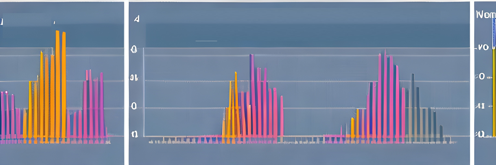

# Two sample methods {#sec-indpttwosamp}

{#fig-hist_art}

Consider comparing independent populations in regard to the mean or median of some attribute, or two treatments by comparing the true mean or median response under each treatment in an experiment. In this section, the following hypothesis tests (HT) for such comparisons are illustrated:

- *t*-based or t-test based for comparing two means  

- Wilcoxon rank sum test for comparing groups

- Randomization test for comparing two means or two medians 

For confidence intervals (CIs), an overview of the two-sample $t$-based CI for comparing means and Wilcoxon-based CI for comparing medians is provided. Equations/formulas used in HT or CIs will be kept at a minimum as the focus is on using software to carry out these methods. That being said, those new to or not comfortable with HT or CIs should consider reviewing @sec-sifwork. These methods will be illustrated using a case study.

For any statistical inferential method to provide meaningful results, several assumptions are made about the data on which the method is intended to be used.

:::{.callout-warning}
## Data assumptions

The methods discussed in this section require one or more of the following assumptions about the data.

- **Assumption 1**. Observations must be independent within each sample and between the two samples. Shared conditions, repeated measurements, or pairing can violate this assumption.

- **Assumption 2**. *No clear outliers* in either sample. 

- **Assumption 3**. *Normality* or *large sample*. The data for each sample should be roughly normally distributed. If the sample size is large enough, the normality assumption is not needed.

- **Assumption 4**. *Equal variance or spread*. The variability in each sample should be about the same. 

While these assumptions are assessed within the illustrations of the inferential methods using a case study, assumption 1 can be assessed based on study design, histograms and boxplots for assumption 2, quantile-quantile plots for normality component of assumption 3, and boxplots, histograms, and sample standard deviation for assumption 4.  

:::


In these sections, we use R functions to conduct the inferential methods described earlier and provide detailed explanations of their use. While other functions may be used for tasks such as importing data and summarizing data numerically or graphically, we do not discuss them in this section as they have been covered in a previous module.

:::{.callout-important}
## Notation

To improve readability, we minimize the use of notation. However, when comparing two populations or treatments denoted by A and B, we use the following notation:

- $\mu_A$ and $\mu_B$ denote the population or true mean response under A and B, respectively.
 
- $\bar{y}_A$ and $\bar{y}_B$ denote the sample mean of the corresponding samples obtained from A and B.

- $\eta_A$ and $\eta_B$ denote the population or true median response under A and B, respectively.
 
- $m_A$ and $m_B$ denote the sample median of the corresponding samples obtained from A and B.

:::
 
 
## Two sample t-based methods for comparing two means 

The independent two-sample t-test is a commonly used hypothesis test for comparing two groups or populations. There are two versions of this test: Student's t-test and Welch's t-test. Both tests can be used to compare whether the difference between the true averages (from two independent populations) is statistically significant or to determine if an effect (when comparing two treatments) is significant. This helps to determine if the difference or effect is due to chance or not. The t-based confidence interval for the difference in true averages provides a range of plausible values for the difference at a specified level of significance. These methods are generally referred to as t-based methods.


Student's two-sample t-based methods assume assumptions 1, 2, 3, and 4 hold. The version of the t-based methods used here are called the Welch two-sample t-based methods, which do not require homogeneity of variances assumption. The Welch two-sample t-test statistic takes the following form:

$$T=\frac{(\bar{y}_{A}-\bar{y}_{B}) -\Delta_0}{\sqrt{\frac{s_{A}^2}{n_{A}}+\frac{s_{B}^2}{n_{B}}}},$$
where $n$ and $s$ denote sample size and standard deviation, and $\Delta_0$ is the mean difference specified by the null (zero here).

The data should consist of two variables of interest: a numerical variable that measures the outcome or response of interest and a factor or grouping variable with two levels. The grouping variable distinguishes the different populations or treatments (A or B). The hypothesis takes the form

$$H_0: \mu_A - \mu_B=0 \qquad H_a: \mu_A -\mu_B \neq 0$$

One may also consider the test in terms of an effect $\delta_\mu=\mu_A - \mu_B$, 

$$H_0: \delta_\mu=0 \qquad H_a: \delta_\mu \neq 0$$

Under $H_0$, the null distribution of Welch's T is approximated by a t-distribution with a certain degree of freedom[^1], and it is used to compute the p-value. The function `two.mean.test()`[^2] computes the test statistic and p-value for the two-sample t-test, as well as provide a confidence interval for $\mu_A - \mu_B$.

[^1]: For the Welch t-test, the degree of freedom can be tedious to compute. Software will provide the corresponding degrees of freedom and p-value. 

[^2]: For a two-sample t-test, `two.mean.test()` is a wrapper function of the R function `t.test`, but `two.mean.test` allows the user to choose the order of the difference.

::: {.callout-tip icon=false}

## R functions
```
### two.mean.test( y ~ x , data , first.level,
###            direction, conf.level,
###            welch)
# y: Replace y with the name of the response (measured)
#  variable of interest.
# x: Replace x with the name of the factor or grouping
#  variable that distinguishes the different populations 
#  or treatments.
# data: Set equal to the data frame name.
# first.level: Set equal to the level/category from the 
#       grouping variable. It determines how the difference 
#       in sample means is computed.  It should be consistent 
#       with the formulation of the hypothesis.
# direction: Set equal to the sign in the alternative: "two.sided",
#             "greater" , or "less".
# conf.level: Set equal to the confidence level for the CI (default is .95). 
#               The function will always provide a CI by default.
# welch: Set equal to TRUE (default) for Welch's t-test. Set
#        to FALSE for Student's t-test.
```
:::

Many of the R functions used in this resource will have identical arguments. Therefore, while the arguments will be provided for any functions used, common arguments such as `data`, `direction`, ... will generally only be described once within a given module. 

 
::: callout-note

We apply two-sample t-based methods (hypothesis testing and CI) to the data described in the case study provided in @sec-casestudy3. The goal is to determine if there is a significant difference in PM10 concentration between Kern and Fresno counties and to estimate the difference between the true means.

The data provided in the case study consists of several variables (`PM10`, `AQI`, ..., `county`, and `City.Name`). A subset of the data were created so that it included  only `PM10` (daily PM10 levels) and `county` (county in which the monitoring site is located) for the two counties of interest. To start, the data are imported and numerical and graphical summaries of the data would be created. However, graphical and numerical data summaries are covered in other modules. The focus here is to assess model assumptions either numerically or graphically.

::: {.panel-tabset}
## R code  

```{r }
#| echo: true
#| eval: true
#| message: false
#| warning: false

# Import the data and save the data in a 
# data frame called 'KernFresnoPM10df'
KernFresnoPM10df <- read.csv("datasets/KernFresnoDailyPM10.2021.csv")

# Load the 'dplyr' package, which provides the 'mutate()' function.
library(dplyr) 

# Tell R that 'county' should be treated as a factor variable by using mutate().
KernFresnoPM10df <- mutate( KernFresnoPM10df, 
              county= as.factor( county ) )


# Print a summary of the data frame, including 
# variable names and other information.
summary( KernFresnoPM10df ) 


# Load the 'lattice' package, which provides the 'bwplot()' function.
library(lattice) 

# Create a box plot of Air Quality Index (AQI) by county levels using the 'bwplot()' function
bwplot(PM10 ~ county,                   #  y ~ x
       data = KernFresnoPM10df,        # set the data frame to use
       xlab = "County",                # set the x-axis label
       ylab = "PM10",                   # set the y-axis label
       main = "PM10 Distribution by County", # set the plot title
       fill = c("gray", "brown"))      # fill the boxes with specified colors

# Load the 'mosaic' package, which allows using 
# formula expressions in 'mean()' and 'sd()'
library( mosaic ) 

# Compute the sample mean for each county
mean( PM10 ~ county ,
   data= KernFresnoPM10df )

# Compute the sample standard deviation for each county
sd( PM10 ~ county ,
  data= KernFresnoPM10df )

```


## Video

```{r}
#| echo: false
#| eval: true

library("vembedr")

embed_youtube("zFTeJ559NIY")

```

:::

The difference in samples means between Kern and Fresno county is 

$$35.067-41.099=\bar{x}_K-\bar{x}_F=-6.032.$$

The estimated difference in mean PM10 levels is -6.032. Before drawing conclusions, we need to consider whether the observations are independent. Readings on nearby days or in nearby counties may be related because of shared weather. A large sample does not remove this concern. We use these data to illustrate the methods, with this limitation in mind[^3].

[^3]: Shuffling the observations does not remove relationships among daily readings. The way the data were collected still matters.


Graphical summaries show the spread and unusual values in each county. The sample standard deviations should be computed for PM10, as in the code above. Comparing the standard deviations helps us assess whether the groups have similar variability, but does not tell us whether the observations are independent.


For illustration, we analyze the data using the two-sample t-based methods, keeping the possible dependence among daily readings in mind. Let $\mu_K$ denote the true mean PM10 level in Kern County, and define $\mu_F$ similarly for Fresno County. Since the aim is to determine whether the mean PM10 levels differ, the hypotheses are:

$$H_0: \mu_K - \mu_F=0 \qquad H_a: \mu_K- \mu_F \neq 0$$

The following code uses `two.mean.test()` to compute the test statistic, the corresponding p-value, and a 99% confidence interval: 

::: {.panel-tabset}
## R code  

```{r }
#| label: fig-ttestpm10
#| fig-cap: The null distribution
#| layout-ncol: 1
#| echo: true
#| message: false
#| warning: false

pm10_fit <- t.test(
  KernFresnoPM10df$PM10[KernFresnoPM10df$county == "Kern"],
  KernFresnoPM10df$PM10[KernFresnoPM10df$county == "Fresno"],
  conf.level=.99)

# Source the function two.mean.test() so that it's R's memory.
source("rfuns/two.mean.test.R")

# Recall that the data were imported and stored in "KernFresnoPM10df"

# The function will require the following information:
# y: Replace with 'PM10'
# x: Replace with 'county'
# data: Set equal to a 'KernFresnoPM10df'
# first.level: The county that appears first in the hypothesis
#                (Kern county), so set equal to "Kern"
# direction: It is a two-sided alternative, so set equal to "two.sided"
# conf.level: Set equal .99 since we seek a 99% CI
# welch: The Welch t-test is the default method here, so using 
#     the default value (TRUE)


two.mean.test( PM10 ~ county ,          # y ~ x
               data = KernFresnoPM10df ,# specify the data frame to use
               first.level = "Kern" ,   # specify the first level in the hypothesis
               direction = "two.sided" ,# specify a two-sided alternative
               conf.level = .99 )       # set the confidence level to .99

```

## Video  
```{r}
#| echo: false
#| eval: true

library("vembedr")

embed_youtube("CoCyvWPDEPs")

```

:::


The output includes the following information: 

- The sample mean and standard deviation under each level of the grouping/factor variable. 

- The value of the observed statistic: $T=-4.8075$

- p-value 

- A confidence interval

The observed test statistic is $T=-4.8075$, with a p-value of approximately $1.63\times10^{-6}$. Since the p-value is less than $\alpha=.01$, we reject $H_0$ if the assumptions hold. The sample results suggest that the mean PM10 levels differ. However, the possible relationships among daily readings limit how confidently we can draw this conclusion.

The 99% CI for the difference in mean PM10 levels, Kern minus Fresno, is (`r round(pm10_fit$conf.int[1], 3)`, `r round(pm10_fit$conf.int[2], 3)`). Since both bounds are negative, the interval suggests that the Fresno sites have a higher mean PM10 level. This interpretation assumes independent observations and applies to the sites represented in the data.

 

:::


## Wilcoxon-based methods for comparing groups

Outliers and departures from normality can affect t-based methods, particularly with small samples. Wilcoxon methods use the ranks of the observations, so extreme values have less influence. These methods still require independent observations. To interpret the test as a comparison of medians, the group distributions should have similar shapes and spreads[^5]. There is no single minimum sample size that applies to every Wilcoxon test[^6].

[^5]: Known distributions are parametric distributions in that they can be expressed using math formulas.  Parametric methods assume that the underlying population data follow a known distribution

[^6]: Non-parametric methods assume fewer things about the data compare to parametric methods.

The Wilcoxon rank sum (Mann–Whitney) test compares the ranks of observations in two independent samples. When the group distributions have similar shapes and spreads, a difference can be interpreted as a difference in population medians. Otherwise, a significant result may reflect other differences between the distributions.

The test statistic for the Wilcoxon rank sum test depends on the ranks of the observed data, and its value will be provided by software. However, some details regarding the computation of the test statistic are provided below:

1. List the observations for both samples from smallest to largest across both groups.

2. Assign the numbers $1$ to $n_A+n_B=N$ to the observations (across both groups) with 1 assigned to the smallest observations and $N$ to the largest observation. These are called ranks of the observations.

3. If there are ties (due to repeated values) in the combined data set, the ranks for the observations in a tie are taken to be the average of the ranks for those observations.

4. Let $W$ denote the sum of the ranks for the observations from group A.

The test statistic then takes the form 

$$U=W-\frac{n_A(n_A+1)}{2}$$
Whereas the two-sample t-test compares means, the Wilcoxon test can compare medians when the group distributions have similar shapes and spreads[^7]. In that case, the hypotheses are:

$$H_0: \eta_A - \eta_B=0 \qquad H_a: \eta_A -\eta_B \neq 0$$ 

One may also consider the test in terms of an effect $\delta_\eta=\eta_A - \eta_B$, 

$$H_0: \delta_\eta=0 \qquad H_a: \delta_\eta \neq 0$$

Under $H_0$, the null distribution of U is called the Wilcoxon distribution and it is used to compute the p-value[^8]. The function `two.wilcox.test()`[^9] computes the test statistic and p-value[^10], as well as a CI. 

The CI describes how far apart the two distributions are, using the median of all differences between an observation in one group and an observation in the other[^11]. When the distributions have similar shapes and spreads, we can interpret it as an interval for the difference in population medians. It is not the difference between two particular readings.

[^7]: If the distributions have different shapes or spreads, the test should not be interpreted as only a comparison of medians.


[^8]: R may compute the p-value directly or use a normal approximation, depending on sample sizes and tied values.


[^9]: The R function `two.wilcox.test` is a wrapper function for the R function `wilcox.test()`. 

[^10]: When R uses a normal approximation, it can adjust for tied values and for using a continuous distribution to describe ranks.

[^11]: R takes the difference between each value in one group and each value in the other, then uses the median of those differences to estimate how far apart the groups are.

::: {.callout-tip icon=false}

## R functions
```
### two.wilcox.test( y ~ x , data , first.level,
###            direction, conf.level)
# y: Replace y with the name of the response (measured)
#  variable of interest
# x: Replace x with the name of the factor or grouping
#  variable that distinguishes the different populations 
#  or treatments
# data: Set equal to the data frame being used.
# first.level: Set equal to a level/category from the grouping 
#              variable. It determines how the difference in 
#              sample means is computed.  It should be consistent
#              with the formulation of the hypothesis.
# direction: Set equal to the sign in the alternative: "two.sided", 
#            "greater" , or "less"
# conf.level: Set equal to the confidence level for the CI (default 
#             is .95). The function will always provide a CI by default.
```
:::


 
::: callout-note

We use the PM10 data to illustrate the Wilcoxon test and its CI. The observations still need to be independent. Violin plots help us assess whether the group distributions have similar shapes and spreads.


::: {.panel-tabset}
## R code

```{r }
#| echo: true
#| eval: true
#| message: false
#| warning: false

library(lattice) # Provides the bwplot() function

# Create a violin plot 
bwplot( PM10 ~ county , 
    data= KernFresnoPM10df , 
    xlab= "County" , 
    ylab= "PM10" ,
    main= "PM10 vs county" , 
    panel= panel.violin ) # set equal to panel.violin to create violin plot

```

## Video
```{r}
#| echo: false
#| eval: true

library("vembedr")

embed_youtube("CxlMXEWbi3U")

```

:::

The violin boxplot makes it clearer that the distribution of PM10 in both counties approximately have the same shape. 

Let $\eta_K$ denote the true median PM10 levels in Kern county. $\eta_F$ is defined analogously for Fresno county. Since an aim is to determine if there is significant difference between PM10 levels in Kern and Fresno county, the hypothesis is

$$H_0: \eta_K - \eta_F=0 \qquad H_a: \eta_K- \eta_F \neq 0$$

The following code uses `two.wilcox.test()` to compute the test statistic, the corresponding p-value, and a 99% confidence interval: 

 

::: {.panel-tabset}
## R code

```{r }
#| label: fig-wtestpm10
#| fig-cap: The null distribution
#| layout-ncol: 1
#| echo: true
#| message: false
#| warning: false

# Source the function two.wilcox.test() so that it's R's memory.
source("rfuns/two.wilcox.test.R")

# The function will require the following information:
# y: Replace with 'PM10'
# x: Replace with 'county'
# data: Set equal to a 'KernFresnoPM10df'
# first.level: The county that appears first in the hypothesis
#                (Kern county), set equal to "Kern"
# direction: It is a two-sided alternative, so set equal to "two.sided"


two.wilcox.test(PM10 ~ county ,           # y ~ x
                data = KernFresnoPM10df , # Specify the data frame to use
                first.level = "Kern" ,    # Specify the first level in the hypothesis
                direction = "two.sided" , # Specify a two-sided alternative
                conf.level = .99 )        # Set the confidence level to .99


```

## Video
```{r}
#| echo: false
#| eval: true

library("vembedr")

embed_youtube("75m-E5v5w20")

```

:::

The output includes the following information: 

- The sample median and IQR under each level of the grouping/factor variable. 

- The value of the observed statistic 

- p-value 

- A confidence interval

Based on the output, the observed value of the test statistic is $U=759219.5$. The p-value is small and positive; use the unrounded R result rather than reporting a rounded zero. Since p-value$\leq\alpha=.01$, we have significant evidence to reject $H_0$.  Therefore, we have strong evidence that there is significant difference between PM10 levels in Kern and Fresno county at the designated monitoring sites.

The 99% CI is (-8.000, -4.000). If the group distributions have similar shapes and spreads, we are 99% confident that the median PM10 level at the Kern sites is between 4 and 8 units lower than at the Fresno sites. As before, this conclusion assumes independent observations.

 


:::


 
## A randomization test using a t-test test statistic 


Randomization tests compare the observed difference with differences obtained by repeatedly shuffling the observations between groups. This shows how unusual the observed result would be if there were no treatment effect. The shuffling must follow how treatments were assigned. For observational data, we also need to consider whether shuffling between groups is reasonable.


Randomization tests also require assumptions. They do not automatically solve problems with related observations or poorly designed studies. For example, we should not freely shuffle repeated measurements from the same person as if they came from different people. Small samples can also make an effect difficult to detect.


### Comparing means {-}

Here we use Welch's t-statistic to compare the means after each shuffle. The function has similar arguments to the t-based method, with additional arguments for the randomization test.


::: {.callout-tip icon=false}

## R functions
```
### two.mean.test( y ~ x , data , first.level,
###            direction, randtest, 
###            nshuffles)
# randtest: Set equal to TRUE to obtain the test statistic and p-value
#      for the randomization test (for comparing means).
# nshuffles: Set equal to the desired number of randomizations. 
```

:::

::: callout-note

We use the PM10 data to illustrate the calculation. Keep in mind that daily readings may be related, so simply shuffling the county labels may not provide a reliable test for these data. Let $\delta_\mu=\mu_K-\mu_F$. The hypotheses are:

$$H_0: \delta_\mu=0 \qquad H_a: \delta_\mu \neq 0$$

The following code uses `two.mean.test()` to compute the test statistic and the corresponding p-value for a randomization test involving a difference in means. 

::: {.panel-tabset}
## R code

```{r }
#| label: fig-rttestpm10
#| fig-cap: The null distribution
#| layout-ncol: 1
#| echo: true
#| eval: false
#| message: false
#| warning: false

# Data was imported earlier in the section 
# and 'mutate' converted 'county' into a factor variable.

# Source the function two.mean.test() so that it's R's memory.
source("rfuns/two.mean.test.R")

# The function will require the following information:
# y: Replace with 'PM10'
# x: Replace with 'county'
# data: Set equal to a 'KernFresnoPM10df'
# first.level: In the hypothesis, Kern county appeared first in the
#       difference, so set equal to "Kern"
# direction: It is a two-sided alternative, so set equal to "two.sided"
# randtest: Set equal to TRUE. 
# nshuffles: Set equal to 30,000 


two.mean.test(PM10 ~ county ,           # specify the variables for the test
              data = KernFresnoPM10df , # specify the data frame to use
              first.level = "Kern" ,    # specify the first level in the hypothesis
              direction = "two.sided" , # specify a two-sided alternative
              randtest = TRUE ,         # perform a simulation-based test
              nshuffles = 30000 )       # set the number of randomizations to 30,000


```

## Video
```{r}
#| echo: false
#| eval: true

library("vembedr")

embed_youtube("Kbkt9vf7eiU")

```

:::

The output is similar to that of Welch's t-test: it provides summary statistics, the observed test statistic, and a p-value estimated from the shuffles. This function does not provide a randomization CI, although the estimated mean difference still helps describe the size of the effect.
 

:::


### Comparing medians {-}

Here we use the Wilcoxon rank statistic after each shuffle. As before, the result can be interpreted as a comparison of medians when the group distributions have similar shapes and spreads. The R function is the same as for the Wilcoxon test, with additional arguments for randomization.

::: {.callout-tip icon=false}

## R functions
```
### two.wilcox.test( y ~ x , data , first.level,
###            direction, conf.level)
###            randtest, nshuffles)
# randtest: Set equal to TRUE to obtain the test statistic and p-value
#      for the randomization test (for comparing medians).
# nshuffles: Set equal to the desired number of randomizations. 
```
:::

::: callout-note
The following example illustrates the calculation with the PM10 data, which contain many tied values. Ties do not automatically make a randomization test better than the usual Wilcoxon calculation. The possible relationships among daily readings remain a concern.

 
```{r }
#| echo: true
#| eval: true
#| message: false
#| warning: false

# Data was imported earlier in the section 
# and 'mutate' converted 'county' into a factor variable.

# Load the 'lattice' package
library(lattice) # provides the histogram() function
histogram(~ PM10 | county ,         # ~ "variable" | "grouping factor"
          data = KernFresnoPM10df , # Specify the data frame to use
          xlab = "PM10" ,           # Label the x-axis
          ylab = "Frequency" ,      # Label the y-axis
          main = "PM10 by county" ) # Add a title to the plot

```
 


To determine if there is significant county effect on PM10 levels when comparing Kern and Fresno county, let $\delta_\eta=\eta_K - \eta_F$. The hypotheses are 

$$H_0: \delta_\eta=0 \qquad H_a: \delta_\eta \neq 0$$

The following code uses `two.wilcox.test()` to compute the test statistic and the corresponding p-value for a randomization test involving a difference in medians 

::: {.panel-tabset}
## R code

```{r }
#| label: fig-rtmedtestpm10
#| fig-cap: The null distribution
#| layout-ncol: 1
#| echo: true
#| eval: false
#| message: false
#| warning: false

# Data was imported earlier in the section 
# and 'mutate' converted 'county' into a factor variable.

# Source the function two.wilcox.test() so that it's R's memory.
source("rfuns/two.wilcox.test.R")

# The function will require the following information:
# y: replace with 'PM10'
# x: replace with 'county'
# data: set equal to a 'KernFresnoPM10df'
# first.level: In the hypothesis, Kern county appeared first in the
#       difference, so set equal to "Kern"
# direction: It is a two-sided alternative, so set equal to "two.sided"
# randtest: Set equal to TRUE. 
# nshuffles: Set equal to 30,000 

two.wilcox.test(PM10 ~ county ,           # Specify the variables for the test
                data = KernFresnoPM10df , # Specify the data frame to use
                first.level = "Kern" ,    # Specify the first level in the hypothesis
                direction = "two.sided" , # Specify a two-sided alternative
                randtest = TRUE ,         # Perform a simulation-based test
                nshuffles = 30000 )       # Set the number of randomizations to 30,000
              


```

## Video
```{r}
#| echo: false
#| eval: true

library("vembedr")

embed_youtube("JkBLLFUfkbg")

```

:::

The output is similar to that of the Wilcoxon test: it provides summary statistics, the observed rank statistic, and a p-value estimated from the shuffles. This function does not provide a randomization CI. The assumptions discussed above still apply.

 


:::


## Sample size estimation and power analysis 

Ideally, estimating sample size for a study is one of the first steps that researchers take prior to collecting data.  Knowing the sample size required to detect a desired effect at the beginning of a project allows one to manage their data collection efforts. Further, this allows for one to determine how much statistical power the test will have to detect an effect. 

The R function `pwr.t2n.test()` from the `pwr` R package can be used to calculate statistical power for a two sample t-test when the sample sizes, significance level ($\alpha$), and effect size are provided. The function `pwr.t.test` from the same package will provide the sample sizes required for a given power level, significance level ($\alpha$), and effect size. Note that variability in each sample is assumed to be about the same. It is assumed the appropriate assumptions about the data are met[^12].

[^12]: The R function `power.welch.t.test()` and `sim.ssize.wilcox.test()` from the `MKpower` R package provides statistical power calculations for the two-sample Welch t-test and two-sample Wilcox rank sum test, respectively. However, these functions may be difficult to use for those not familiar with power analysis.
 
::: {.callout-tip icon=false}

## R functions
```
### power.t2n.test( n1 , n2 , d , sig.level , 
###                    power, alternative)
# n1: Set equal to the number of observations in first sample.
# n2: Set equal to the effect size.
# d: Set equal to the effect size.
# sig.level: Set equal to the desired alpha value (significance level)
# power: Set equal to the desired power (a number between 0 and 1). 
# alternative: The direction of the alternative. Set equal to "two.sided".
#
#
### power.t.test(power, d , sig.level , 
###                  alternative , type)
# power: Set equal to the desired power.
# type: Set equal to "two.sample" .
#
```

:::

The effect size refers to Cohen's $d$, which is defined as the difference between the true means divided by the pooled standard deviation. Cohen's $d$ is typically interpreted as follows:

- Small effect size: $d = 0.20$

- Medium effect size: $d = 0.50$ 

- Large effect size: $d = 0.80$ or higher.

These are suggested guidelines and may vary slightly depending on the specific field of research or context of the study. 

 

::: callout-note

Refer to the data described in the case study provided in @sec-casestudy3. Let's suppose the goal is to determine the statistical power of a two sample t-test if one wanted to detect a medium-sized effect when the sample size from each county is 100 at $\alpha=.01$. 
```{r }
#| echo: true
#| eval: true
#| message: false
#| warning: false


library(pwr) # provides pwr.t2n.test

# Note:  The output of this function call will be the statistical power for the t-test.
pwr.t2n.test(n1 = 100 ,          # Set the sample size for group 1
             n2 = 100 ,          # Set the sample size for group 2
             d = 0.50 ,          # Set Cohen's d
             sig.level = 0.01 ,  # Set the significance level for the test
             alternative = "two.sided") # Specify a two-sided alternative hypothesis

```
 
The statistical power of this test is $.824$. To further increase the power, one may increase the effect size (the larger it is, the easier it is to detect), increase the value of $\alpha$ (make it easier to reject $H_0$ and find a significant effect), and/or increase the sample sizes. The sample data consisted of at least 1000 observations from each county, so set each sample to $1000$:
```{r }
#| echo: true
#| eval: true
#| message: false
#| warning: false

pwr.t2n.test(n1 = 1000 ,
             n2 = 1000 , 
             d = .50 , 
             sig.level = 0.01 ,
             alternative = "two.sided" )

```

If instead you seek the required sample size for a given power, the argument `power` could be set to the desired power in the function `pwr.t.test()`:
```{r }
#| echo: true
#| eval: true
#| message: false
#| warning: false

# Note:  The output of this function call will be the required sample size for the t-test.
pwr.t.test(power = 0.90 ,         # Set the desired power level
           d = 0.50 ,             # Set the standardized mean difference between groups
           sig.level = 0.01 ,     # Set the significance level for the test
           type = "two.sample" ,  # Set a two-sample t-test
           alternative = "two.sided") # Specify a two-sided alternative hypothesis

```

:::
 

Both t-based and Wilcoxon methods can be useful. Neither is always more powerful than the other. The better choice depends on the research question, how the data were collected, and the shape of the data distributions.


